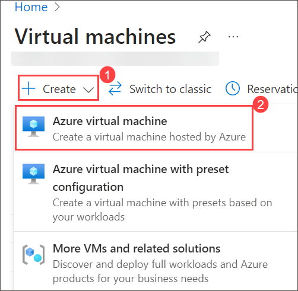
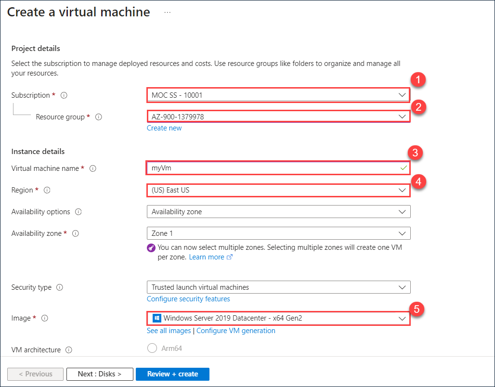
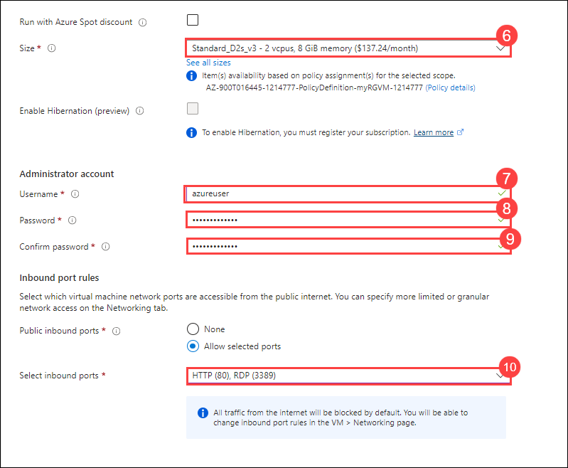
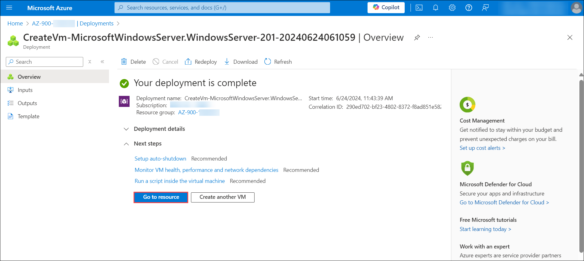
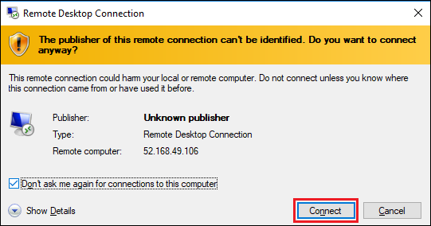
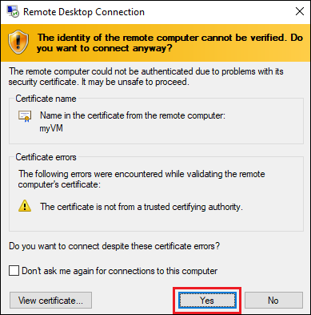
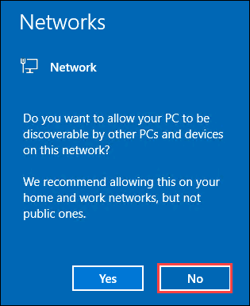
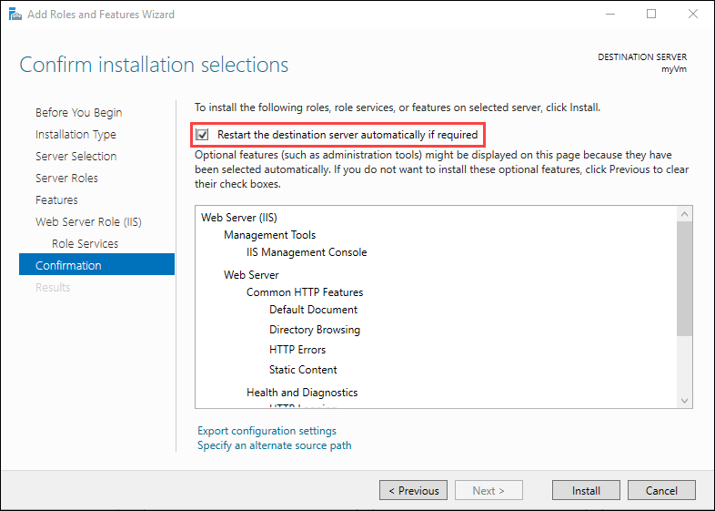
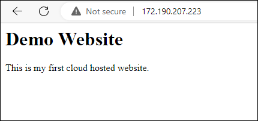

# Lab 01 - Create a virtual machine in the portal

## Lab overview

An Azure Virtual Machine (VM) is a computing resource provided by Microsoft Azure. It allows users to create and use virtualized computing instances in the cloud. Azure Virtual Machines enable users to run applications, host websites, and perform various computing tasks without needing to purchase and maintain physical hardware.

In this walkthrough, we will create a virtual machine in the Azure portal, connect to the virtual machine, install the web server role and test.

## Lab objectives

In this lab, you will complete the following tasks:

+ Task 1: Create the virtual machine
+ Task 2: Connect to the virtual machine
+ Task 3: Host a Basic Website on your New Cloud VM

## Estimated timing: 30 minutes

## Architecture diagram

 

**Note**: Take time during this walk-through to click and read the Informational icons.

### Task 1: Create the virtual machine

In this task, we will create a Windows Server 2019 Datacenter - Gen2 virtual machine. 

1. On Azure Portal page, in Search resources, services, and docs (G+/) box at the top of the portal, enter **Virtual machines (1)**, and then select **Virtual machines (2)** under services.

    

1. On the **Virtual machines** blade, click **+ Create (1)** and choose **Azure virtual machine (2)**.

     

1. On the **Basics** tab, fill in the following information (leave the defaults for everything else):

    | Settings | Values |
    |  -- | -- |
    | Subscription | **Accept default subscription** (1)|
    | Resource group | **AZ-900-<inject key="DeploymentID" enableCopy="false"/>** (2) |
    | Virtual machine name | **myVm** (3)|
    | Region | Select **<inject key="Region" enableCopy="false" />** (4)|
    | Image | **Windows Server 2019 Datacenter - x64 Gen2** (5)|
    | Size | **Standard_D2s_v3** (6)|
    | Administrator account username | **azureuser** (7)|
    | Administrator account password | **Pa$$w0rd1234** (8)|
    | Inbound port rules  | **Allow selected ports** (9)|
    | Select inbound ports | **RDP (3389)** and **HTTP (80)** (10)|
    |||
   
    
   
    

1. Click **Next : Disks >** to switch to the **Disks** tab and in the **OS Disk type** select **Standard HDD** from the dropdown and leave everything else as default and click **Next : Networking >**. 

   

1. Within the Networking tab, look for the **Select inbound ports**:

    | Settings | Values |
    | -- | -- |
    | Select inbound ports | **HTTP (80), RDP (3389)**|
   
    >**Note:** - Verify that both port 80 and 3389 are selected

1. Click **Next : Management >** to switch to the **Management** tab and leave everything as default.

1. Click **Next : Monitoring >** to switch to the **Monitoring** tab, select the following setting:

    | Settings | Values |
    | -- | -- |
    | Boot diagnostics | **Disable**|
  
1. Leave the remaining defaults and then click the **Review + create** button at the bottom of the page.

1. Once Validation is passed click the **Create** button. It can take anywhere from five to seven minutes to deploy the virtual machine.

1. You will receive updates on the deployment page and via the **Notifications** area (the bell icon in the top menu).

   >**Note**: Here is the reference link for virtual machine https://azure.microsoft.com/en-in/resources/cloud-computing-dictionary/what-is-a-virtual-machine/

### Task 2: Connect to the virtual machine

In this task, we will connect to our new virtual machine using RDP. 

1. Once the deployment is complete, click on **Go to resource** you will be directed to the page of the newly created Virtual Machine.

    
   
1. On the virtual machine **Overview** blade, click the **Connect** button and choose the **Connect** from the dropdown.

    

    >**Note:** The following directions tell you how to connect to your VM from a Windows computer. On a Mac, you need an RDP client such as this Remote Desktop Client from the Mac App Store and on a Linux computer you can use an open source RDP client.

1. Within the **Connect** page, click on **Download RDP File**.

   

1. Once the file is downloaded,you will be directed with a warning, click on **Keep**.

1. **Open** the downloaded RDP file and click **Connect** when prompted. 

    

1. In the **Windows Security** window, select **More choices** and then **Use a different account**. Provide the username (.\azureuser) and the password (Pa$$w0rd1234). Click **OK** to connect.

    

1. You may receive a certificate warning during the sign-in process. Click **Yes** or to create the connection and connect to your deployed VM. You should connect successfully.

    

### Task 3: Host a Basic Website on your New Azure Cloud VM

In this task, install the Web Server role on the server and host a basic website.

1. In the Server Manager (which should launch automatically) once you connect to the vm, select **Add roles and features** as shown below in the screenshot: 

    

    >**Note:** If you get a pop-up related to **Networking** click **No**. If you get a tab Server Manager, close the tab.
    
    

1. Within the **Add Roles and Features Wizard** dialog box, click on **Next >**.

1. Ensure **Role-based or feature-based installation** is selected. Click **Next >**.

1. Ensure **Select a server from the server pool** is selected, and that your VM appears in the list below. Click on **Next >**.

1. In the Server roles list, scroll to near bottom of the list and check **Web Server (IIS)**. Click on **Add Features**.

    

1. Click on **Next >** until you reach the **Confirm installation selections** page and make sure **Restart the destination server automatically if required** is checked. Then click on **Install**.

    

    >**Note:** If a pop-up appears warning about the automatic server restart, select **Yes**.

1. When the installation completes, click on **Close** and back on the server manager portal, go to **Tools** > **Internet Information Services (IIS) Manager**.

    

1. In the Internet Information Services (IIS) Manager window, locate your server’s Default Web Site in the Connections tree.

    

1. Now, click on **Basic Settings** in the **Actions** menu. In the new pop-up dialog box, locate the **Physical Path** and click **Ok**. This is where you'll put your website html file.

    

   >**Note:** Keep a note of the path as it will be required in the preceding steps.

1. Go to the Physical Path location specified in the Basic Settings. Copy and paste **iisstart.html** file in the same location. Rename the new file to **Default.html**. RIght click on Default.html file click on **Open With > Notepad** and paste the below code into the same file and save the file.

    ```
    <html>
    <body>
        <h1>Demo Website</h1>
        <p>This is my first cloud hosted website.</p>
    </body>
    </html>
    ```
    

1. Now back in the Azure portal, navigate back to the Overview blade of myVM and use the Copy to clipboard button to copy the public IP address of myVm.

    

1. Open a new browser tab, paste the public IP address into the URL text box, and press the Enter key to browse to it. The custom created basic website shows up.

    

<validation step="657b4747-1449-4a5c-886e-0d3096a834ba" />

> **Congratulations** on completing the task! Now, it's time to validate it. Here are the steps:
> - If you receive a success message, you can proceed to the next task.
> - If not, carefully read the error message and retry the step, following the instructions in the lab guide. 
> - If you need any assistance, please contact us at labs-support@spektrasystems.com. We are available 24/7 to help you out.
    
### Review

In this lab, you have completed:
- Created the virtual machine
- Connected to the virtual machine
- Hosted a Basic Website on your New Cloud VM

## Reference links

- https://azure.microsoft.com/en-in/resources/cloud-computing-dictionary/what-is-a-virtual-machine/

- https://learn.microsoft.com/en-us/partner-center/marketplace/azure-vm-use-approved-base

## You have successfully completed this lab. Proceed with the next lab.
