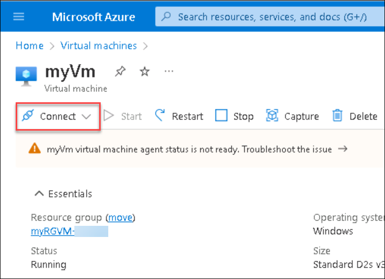
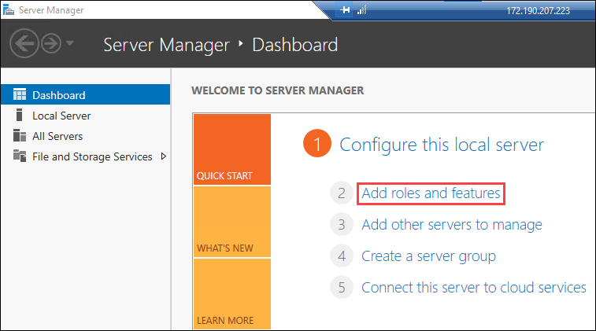
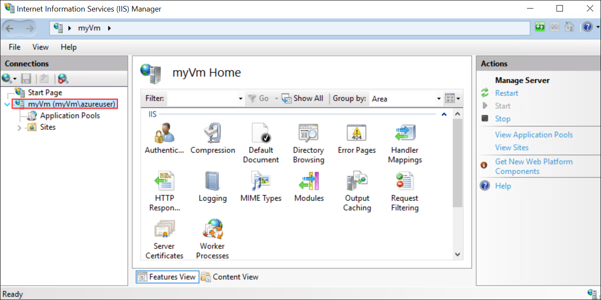
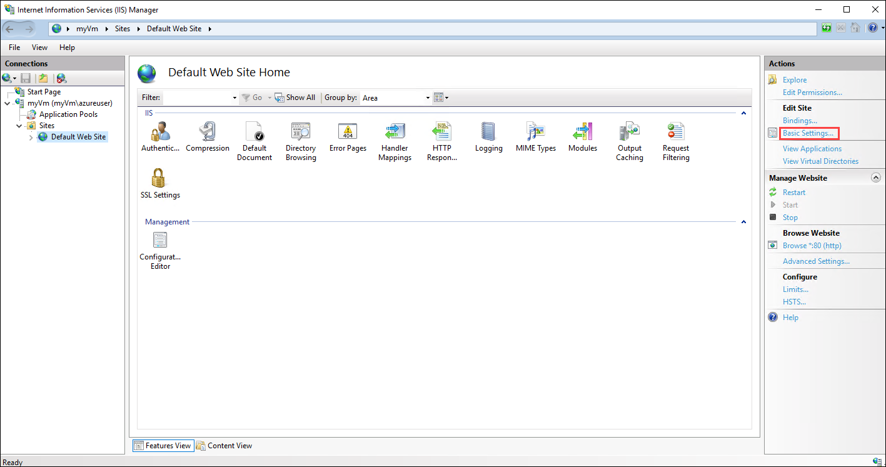
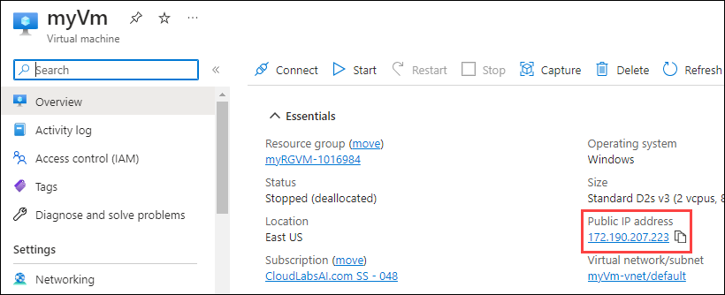

# Lab 01 - Create a virtual machine in the portal

In this walkthrough, we will create a virtual machine in the Azure portal, connect to the virtual machine, install the web server role and test. 

>**Note**: Take time during this walk-through to click and read the Informational icons. 

## Objectives

In this lab, you will complete the following tasks:

+ Task 1: Create the virtual machine
+ Task 2: Connect to the virtual machine
+ Task 3: Host a Basic Website on your New Cloud VM

## Estimated timing: 10 minutes

## Architecture diagram


# Task 1: Create the virtual machine

In this task, we will create a Windows Server 2019 Datacenter - Gen2 virtual machine. 

1. Click on the Azure Portal icon on the VM desktop and login with the Azure credentials from the Lab Environment output page.

2. From the **Search resources, Services, and docs(G+/)** blade, search for and select **Virtual machines**, and then click **+ Create** and choose **Azure virtual machine**.

3. On the **Basics** tab, fill in the following information (leave the defaults for everything else):

    | Settings | Values |
    |  -- | -- |
    | Subscription | **Choose your subscription**|
    | Resource group | **myRGVM-<inject key="DeploymentID" enableCopy="false"/>** (use existing) |
    | Virtual machine name | **myVm** |
    | Location | **(US) East US**|
    | Image | **Windows Server 2019 Datacenter - Gen2**|
    | Size | **Standard_D2s_v3**|
    | Administrator account username | **azureuser** |
    | Administrator account password | **Pa$$w0rd1234**|
    | Inbound port rules  | **Allow select ports**|
    | Select inbound ports | **RDP (3389)** and **HTTP (80)**|
    | | |

   > **Note** : DeploymentID can be obtained from the Lab Environment output page.

4. Switch to the Networking tab, and look for the **Select inbound ports**:

    | Settings | Values |
    | -- | -- |
    | Select inbound ports | **HTTP (80), RDP (3389)**|
    | | |

    **Note** - Verify that both port 80 and 3389 are selected

5. Switch to the **Monitoring** tab, select the following setting:

    | Settings | Values |
    | -- | -- |
    | Boot diagnostics | **Disable**|
    | | |

6. Leave the remaining defaults and then click the **Review + create** button at the bottom of the page.

7. Once Validation is passed click the **Create** button. It can take anywhere from five to seven minutes to deploy the virtual machine.

8. You will receive updates on the deployment page and via the **Notifications** area (the bell icon in the top menu).


# Task 2: Connect to the virtual machine

In this task, we will connect to our new virtual machine using RDP. 

1. Search for **myVm** and select your new virtual machine.

    **Note**: You could also use the **Go to resource** link on the deployment page or the link to the resource in the **Notification** area.

2. On the virtual machine **Overview** blade, click the **Connect** button and choose the **RDP** tab.

    

    **Note**: The following directions tell you how to connect to your VM from a Windows computer. On a Mac, you need an RDP client such as this Remote Desktop Client from the Mac App Store and on a Linux computer you can use an open source RDP client.

3. Within the **Connect with RDP** section of the RDP tab, keep the default options to connect with the public IP address over port 3389 and click **Download RDP File**.

4. **Open** the downloaded RDP file and click **Connect** when prompted. 

    

5. In the **Windows Security** window, select **More choices** and then **Use a different account**. Provide the username (.\azureuser) and the password (Pa$$w0rd1234). Click **OK** to connect.

    

6. You may receive a certificate warning during the sign-in process. Click **Yes** or to create the connection and connect to your deployed VM. You should connect successfully.

    

Congratulations! You have deployed and connected to a Windows Server virtual machine in Azure

# Task 3: Host a Basic Website on your New Cloud VM

In this task, install the Web Server role on the server and host a basic website.

1. In the Server Manager (which should launch automatically) once you connect to the vm, select **Add roles and features** as shown below in the screenshot: 

    

2. Within the **Add Roles and Features Wizard** dialog box, click on **Next**.

3. Ensure **Role-based or feature-based installation** is selected. Click Next.

4. Ensure **Select a server from the server pool** is selected, and that your VM appears in the list below. Click on **Next**.

5. In the Server roles list, scroll to near bottom of the list and check **Web Server (IIS)**. Click on **Add Features**.

    

6. Click on **Next** until you reach the **Confirm installation selections** page and make sure **Restart the destination server automatically if required** is checked. Then click on **Install**.

    

    >**Note**: If a pop-up appears warning about the automatic server restart, select **Yes**.

7. When the installation completes, back on the server manager portal, go to **Tools** > **Internet Information Services (IIS) Manager**.

    

8. In the Internet Information Services (IIS) Manager window, locate your server’s Default Web Site in the Connections tree.

    

9. Now, click on **Basic Settings** in the **Actions** menu. In the new pop-up dialog box, locate the **Physical Path**. This is where you'll put your website html file.

    

10. Create a very basic html file. Save it as **Default.htm** and place it in the Physical Path location specified in the Basic Settings. For example:

    ```
    <html>
    <body>
        <h1>Demo Website</h1>
        <p>This is my first cloud hosted website.</p>
    </body>
    </html>
    ```

11. Now back in the Azure portal, navigate back to the Overview blade of myVM and use the Copy to clipboard button to copy the public IP address of myVm.

    

12. Open a new browser tab, paste the public IP address into the URL text box, and press the Enter key to browse to it. The custom created basic website shows up.

    

    > - **Congratulations** on completing the task! Now, it's time to validate it. Here are the steps:
    > - Click the (...) icon located at the upper right corner of the lab guide section and navigate to the Lab Validation Page.
    > - Hit the Validate button for the corresponding task.If you receive a success message, you can proceed to the next task. 
    > - If not, carefully read the error message and retry the step, following the instructions in the lab guide.
    > - If you need any assistance, please contact us at labs-support@spektrasystems.com. We are available 24/7 to help you out.

13. Select the **Resources** tab, then in actions select deallocate for deallocate the VM, it will be Cost effective.

### Review
In this lab, you have completed:
- Create the virtual machine
- Connect to the virtual machine
- Host a Basic Website on your New Cloud VM

## You have successfully completed this lab.
