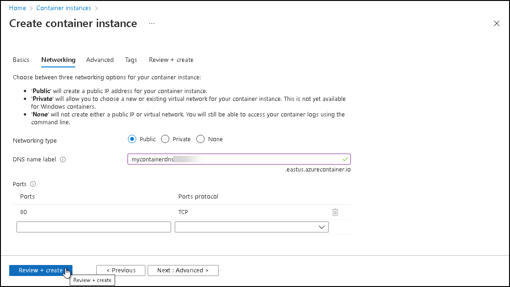
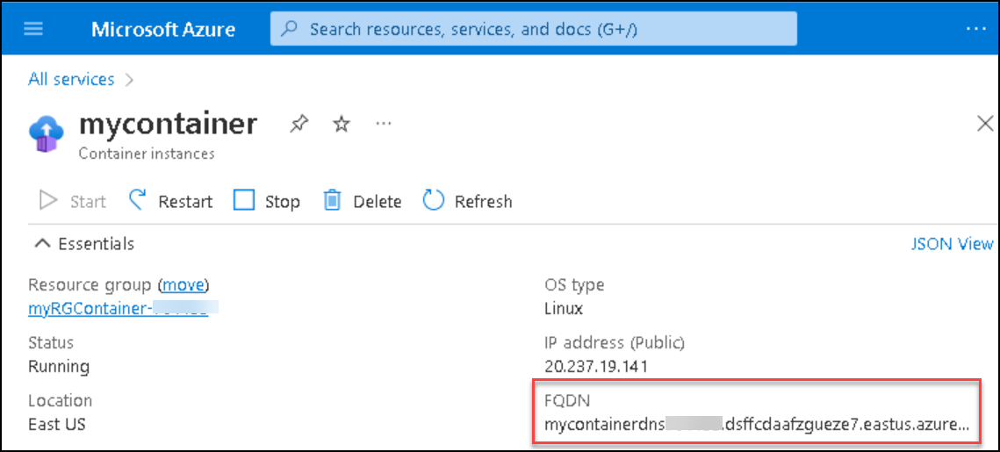
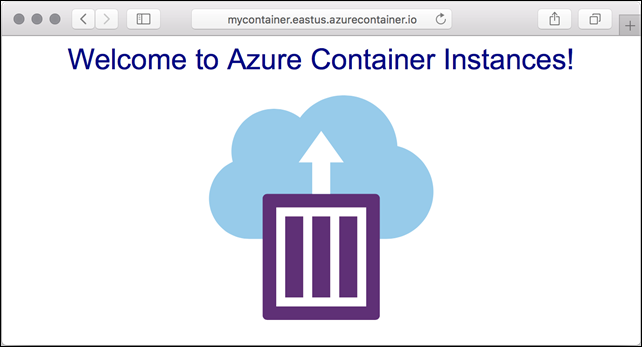

# Lab 03 - Deploy Azure Container Instances

## Lab overview

In this walkthrough, we create, configure, and deploy a Docker container by using Azure Container Instances (ACI) in the Azure Portal. The container is a Welcome to ACI web application that displays a static HTML page.

## Lab objectives

In this lab, you will complete the following tasks:

+ Task 1: Create a container instance
+ Task 2: Verify deployment of the container instance

## Estimated timing: 15 minutes

## Architecture diagram

 

### Task 1: Create a container instance

In this task, we will create a new container instance for the web application. 

1. From the **Search resources, Services, and docs(G+/)** blade, search for and select **Container instances** and then click **+ Create**. 

1. Provide the following Basic details for the new container instance  (leave the defaults for everything else)): 

	| Setting| Value|
	|----|----|
	| Subscription | **Choose your subscription** |
	| Resource group | **myRGContainer-<inject key="DeploymentID" enableCopy="false" />** |
	| Container name| **mycontainer**|
	| Region | **(US) East US** |
	| Image source| **Other registry**|
	| Image type| **Public**|
	| Image| **mcr.microsoft.com/azuredocs/aci-helloworld**|
	| OS type| **Linux** |
	| Size| ***Leave at the default***|

	
1. Configure the Networking tab . Leave all other settings at their default values .

	| Setting| Value|
	|--|--|
	| DNS name label| **mycontainerdns<inject key="DeploymentID" enableCopy="false" />** |

	**Note**: Your container will be publicly reachable at dns-name-label.region.azurecontainer.io. If you receive a **DNS name label not available** error message following the deployment.

    

1. Click **Review and Create** to start the automatic validation process.

1. Click **Create** to create the container instance. 

1. Monitor the deployment page and the **Notifications** page. 

1. While you wait you may be interested in viewing the [sample code behind this simple application](https://github.com/Azure-Samples/aci-helloworld). Browse the \app folder. 

### Task 2: Verify deployment of the container instance

In this task, we verify that the container instance is running by ensuring that the welcome page displays.

1. After the deployment is complete, click the **Go to resource** link the deployment blade or the link to the resource in the Notification area.

1. On the **Overview** blade of **mycontainer**, ensure your container **Status** is **Running**. 

1. Locate the Fully Qualified Domain Name (FQDN).

   

1. Copy the container's FQDN into the new browser tab and press **Enter**. The Welcome page should display.

   **Note**: It might take 10-15 minutes to load the page.
 
   
	
   **Note**: You could also use the container IP address in your browser.
   
    > **Congratulations** on completing the task! Now, it's time to validate it. Here are the steps:
    > - Click Lab Validation tab located at the upper right corner of the lab guide section and navigate to the Lab Validation tab.
    > - Hit the Validate button for the corresponding task.
    > - If you receive a success message, you can proceed to the next task. If not, carefully read the error message and retry the step, following the instructions in the lab guide.
    > - If you need any assistance, please contact us at labs-support@spektrasystems.com. We are available 24/7 to help you out.
    
### Review
In this lab, you have completed:
- Create a container instance
- Verify deployment of the container instance
  
## You have successfully completed this lab.

