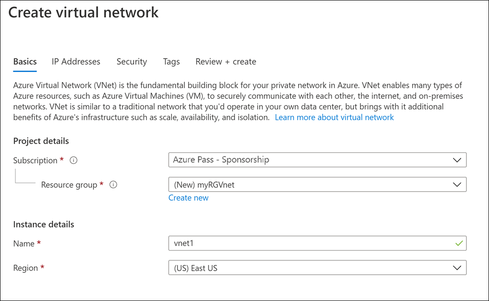
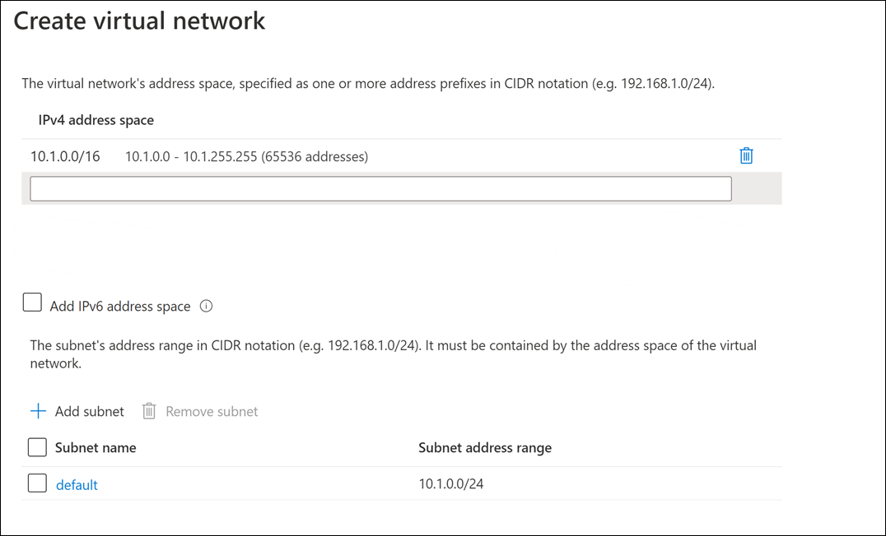
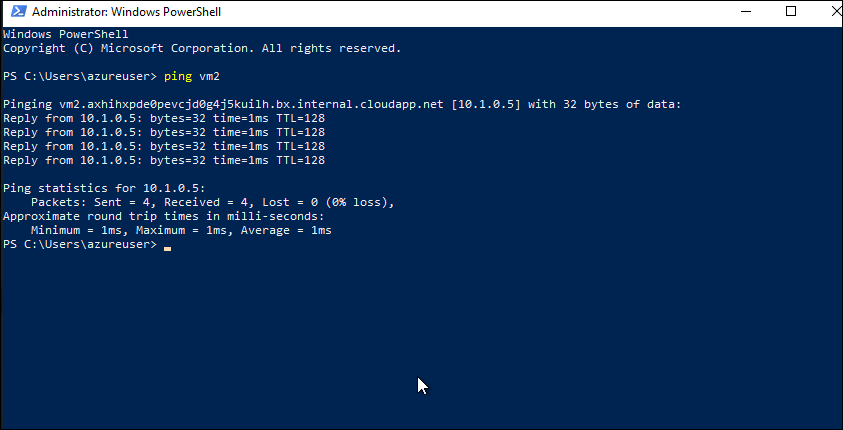

# Lab 04 - Create a virtual network

## Lab overview

In this walkthrough, we will create a virtual network, deploy two virtual machines onto that virtual network and then configure them to allow one virtual machine to ping the other within that virtual network.

## Lab objectives

In this lab, you will complete the following tasks:

+ Task 1: Create a virtual network
+ Task 2: Create two virtual machines
+ Task 3: Test the connection

## Estimated timing: 20 minutes

## Architecture diagram

 

### Task 1: Create a virtual network

In this task, we will create a virtual network. 

**Note:** Before beginning the lab, disable both the public and private firewall in your virtual machine by opening the Start menu > Settings > Network and Internet > Locate Windows Firewall

1. On the Azure portal, from the **Search resources, Services, and docs(G+/)** blade, search for and select **Virtual networks**, and then click **+ Create**. 

1. On the **Create virtual network** blade, fill in the following (leave the defaults for everything else):


   | Setting | Value | 
   | ---     | ---   |
   | Name    | **vnet1** |
   | Subscription | **Choose your subscription**  |
   | Resource group |  **myRGVNet-<inject key="DeploymentID" enableCopy="false"/>** |
   | Location | **(US) East US** |
 

1. On the **Create virtual network** blade, go to the IP Addresses tab and delete precreated IP address and create the new address space.

    | Setting | Value | 
    | --- | --- |
    | Address space |**10.1.0.0/16**|
    
 1. Click on **+ Add Subnet** and enter the following (Delete if any subnet exists already with the name default) then click on **Add**:
  
    | Setting | Value | 
    | --- | --- |
    | Subnet Name |**default**|
    | Subnet Address range | **10.1.0.0/24**|
  
    
 

    
    

1. Click the **Review + create** button. Ensure the validation passes.

1. Click the **Create** button to deploy the virtual network. 

    **Note**: In your organization, how will you know which virtual networks and IP addressing you will need?

### Task 2: Create two virtual machines

In this task, we will create two virtual machines in the virtual network. 

1. From the **Search resources, Services, and docs(G+/)** blade, search for **Virtual machines** and then click **+ Create** and choose **Azure virtual machine**.

1. On the **Basics** tab, fill in the following information (leave the defaults for everything else):

   | Setting | Value | 
   | --- | --- |
   | Subscription | **Use default supplied**  |
   | Resource group |  **myRGVNet-<inject key="DeploymentID" enableCopy="false"/>** |
   | Virtual machine name | **vm1**|
   | Region | **(US) East US** |
   | Image | **Windows Server 2019 Datacenter -Gen2** |
   | Username| **azureuser** |
   | Password| **Pa$$w0rd1234** |
   | Public inbound ports| Select **Allow selected ports**  |
   | Selected inbound ports| **RDP (3389)** |
   |||

1. Select the **Networking** tab. Make sure the virtual machine is placed in the vnet1 virtual network. Review the default settings, but do not make any other changes. 

   | Setting | Value | 
   | --- | --- |
   | Virtual network | **vnet1** |
   |||

1. Click **Review + create**. After the Validation passes, click **Create**. Deployment times can vary but it can generally take between three to six minutes to deploy.

1. Monitor your deployment, but continue on to the next step. 

1. Create a second virtual machine by repeating steps **2 to 4** above. Make sure you use a different virtual machine name, that the virtual machine is within the same virtual network, and is using a new public IP address:

    | Setting | Value |
    | --- | --- |
    | Resource group | **myRGVNet-<inject key="DeploymentID" enableCopy="false"/>** |
    | Virtual machine name |  **vm2** |
    | Virtual network | **vnet1** |
    | Public IP | (new) **vm2-ip** |
    |||

1. Wait for both virtual machines to deploy. 

### Task 3: Test the connection 

In this task, we will try to test whether the virtual machines can communicate (ping) each other. If not we will install a rule to allow an ICMP connection. Usually ICMP connections are automatically blocked.

1. From the **All resources** blade, search for **vm1**, open its **Overview** blade, and make sure its **Status** is **Running**. You may need to **Refresh** the page.

1. On the **Overview** blade, click the **Connect** button and select RDP.

    **Note**: The following directions tell you how to connect to your VM from a Windows computer. 

1. On the **Connect to virtual machine** blade, keep the default options to connect by IP address over port 3389 and click **Download RDP File**.

1. Open the downloaded RDP file and click **Connect** when prompted. 

1. In the **Windows Security** window, type the username **azureuser** and password **Pa$$w0rd1234** and then click **OK**.

1. You may receive a certificate warning during the sign-in process. Click **Yes** or to create the connection and connect to your deployed VM. You should connect successfully. Close the Windows Server and Dashboard windows that pop up. You should see a Blue Windows background. You are now in your virtual machine.

    **Repeat step 1 to 6 for vm2.**

1. In **both** newly created virtual machines(vm1,vm2), connect via RDP and disable both the public and private firewall by opening the Start menu > Settings > Network and Internet > Locate Windows Firewall.

1. Open up a PowerShell command prompt on the virtual machine(vm1), by clicking the **Start** button, typing **PowerShell**, right clicking **Windows PowerShell** in the right-click menu, and clicking **Run as administrator**

1. Try to ping vm2 (make sure vm2 is running). 
    ```
    ping vm2
    ```
1. You should be successful. You have pinged VM2 from VM1.
    
     
   
     > **Congratulations** on completing the task! Now, it's time to validate it. Here are the steps:
     > - Click Lab Validation tab located at the upper right corner of the lab guide section and navigate to the Lab Validation tab.
     > - Hit the Validate button for the corresponding task.
     > - If you receive a success message, you can proceed to the next task. If not, carefully read the error message and retry the step, following the instructions in the lab guide.
     > - If you need any assistance, please contact us at labs-support@spektrasystems.com. We are available 24/7 to help you out.

### Review
In this lab, you have completed:
- Create a virtual network
- Create two virtual machines
- Test the connection
 
## You have successfully completed this lab.
