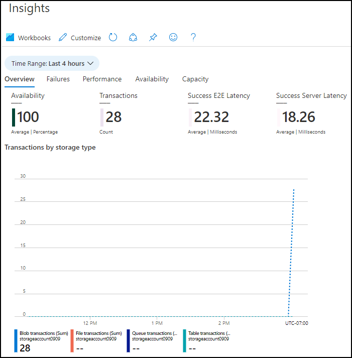

# Lab 05 - Create blob storage

## Lab overview

In this walkthrough, we will create a storage account, then work with blob storage files.

## Lab objectives

In this lab, you will complete the following tasks:

+ Task 1: Create a storage account
+ Task 2: Work with blob storage
+ Task 3: Monitor the storage account

## Estimated timing: 15 minutes

## Architecture diagram

 

### Task 1: Create a storage account

In this task, we will create a new storage account. 

1. From the **All services** blade, search for and select **Storage accounts**, and then click **+ Create**. 

1. On the **Basics** tab of the **Create storage account** blade, fill in the following information.Leave the defaults for everything else.

    | Setting | Value | 
    | --- | --- |
    | Subscription | **Choose your subscription** |
    | Resource group | **myRGStorage-<inject key="DeploymentID" enableCopy="false" />** |
    | Storage account name | **storageaccount<inject key="DeploymentID" enableCopy="false" />** |
    | Location | **(US) East US**  |
    | Performance | **Standard** |
    | Redundancy | **Locally redundant storage (LRS)** |

1. On the **Advanced** tab of the **Create storage account** add  Access tier (default) **Hot**.

1. Click **Review + Create** to review your storage account settings and allow Azure to validate the configuration. 

1. Once validated, click **Create**. Wait for the notification that the account was successfully created. 

1. From the Home page, search for and select **Storage accounts** and ensure your new storage account is listed.

    

### Task 2: Work with blob storage

In this task, we will create a Blob container and upload a blob file. 

1. Click the name of the new storage account, scroll to the **Data storage** section, and then click **Containers**.

1. Click **+ Container** and complete the information. Use the Information icons to learn more. When done click **Create**.

   | Setting | Value |
   | ---- | ---- |
   | Name | **container1**|
   | Public access level| **Private (no anonymous access)** |
    
    

1. Click the **container1** container, and then click **Upload**.

1. Browse to a file on your local computer. 

    **Note**: You can create an empty `.txt` file or use any existing file. Consider choosing a file of a small size to minimize the upload time.

1. Click the **Advanced** arrow, leave the default values but review the available options, and then click **Upload**.

    **Note**: You can upload as many blobs as you like in this way. New blobs will be listed within the container.

1. Once the file is uploaded, right-click on the file and notice the options including View/edit, Download, Properties, and Delete. 

1. As you have time, from the storage account blade, review the options for Files, Tables, and Queues.

### Task 3: Monitor the storage account

1. If needed, return to the storage account blade and click **Diagnose and solve problems**. 

1. Explore some of the most common storage problems. Notice there are multiple troubleshooter.

1. On the storage account blade, scroll down to the **Monitoring** section and click **Insights**. Notice there is information on Failures, Performance, Availability, and Capacity. Your information will be different.

    

    > **Congratulations** on completing the task! Now, it's time to validate it. Here are the steps:
    > - Click Lab Validation tab located at the upper right corner of the lab guide section and navigate to the Lab Validation tab.
    > - Hit the Validate button for the corresponding task.
    > - If you receive a success message, you can proceed to the next task. If not, carefully read the error message and retry the step, following the instructions in the lab guide.
    > - If you need any assistance, please contact us at labs-support@spektrasystems.com. We are available 24/7 to help you out.

### Review
In this lab, you have completed:
- Create a storage account
- Work with blob storage
- Monitor the storage account

## You have successfully completed this lab.
