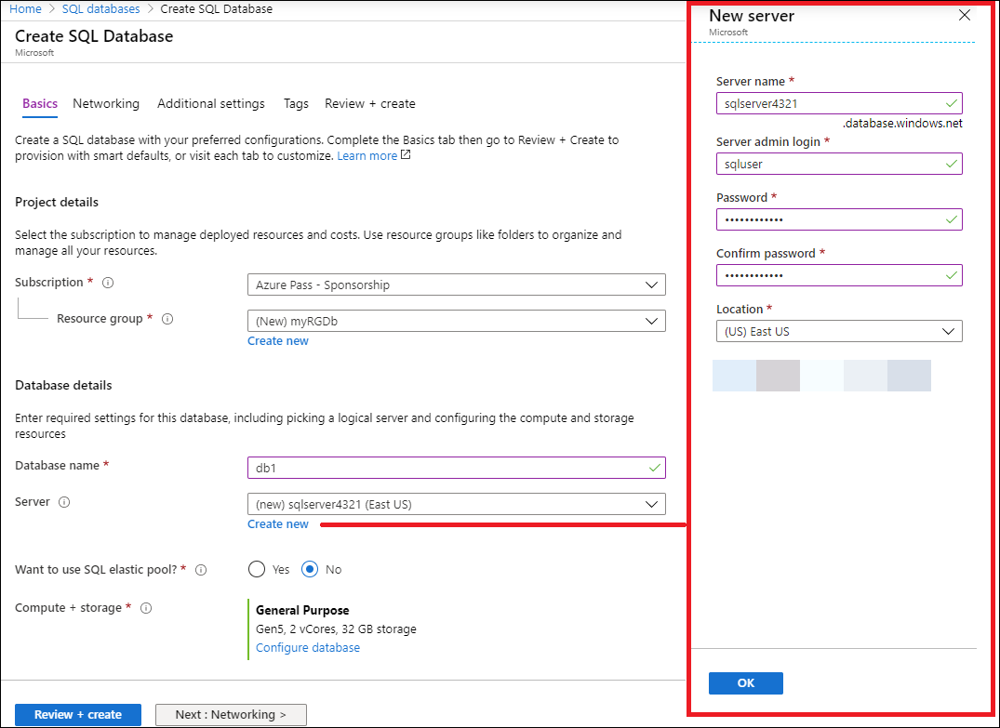
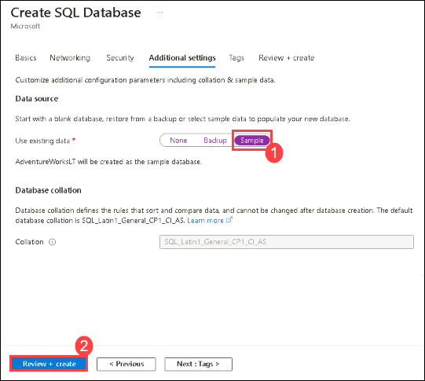
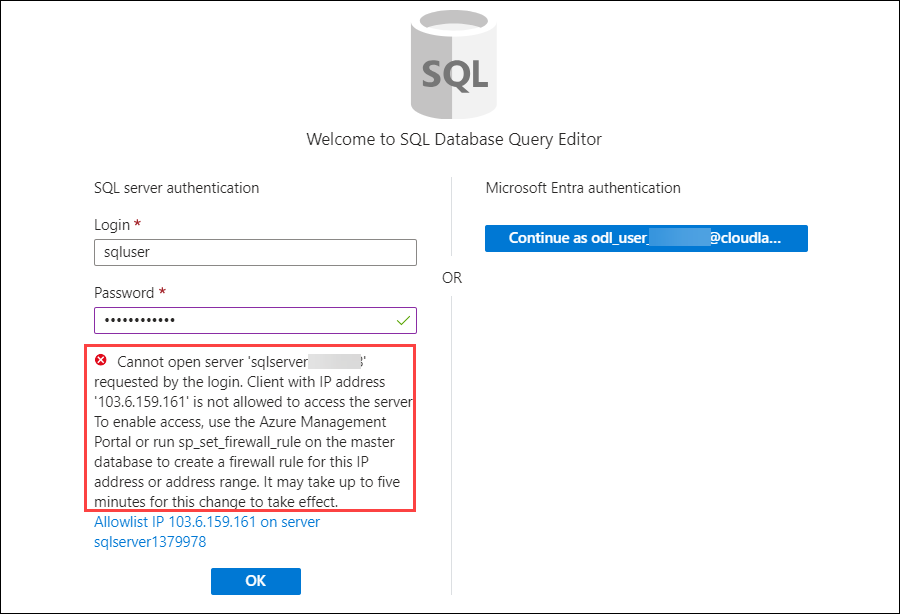
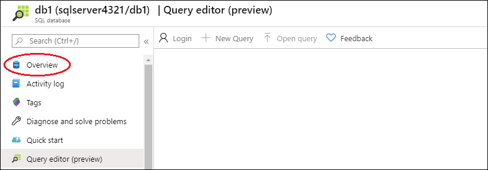
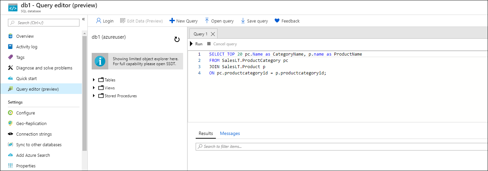
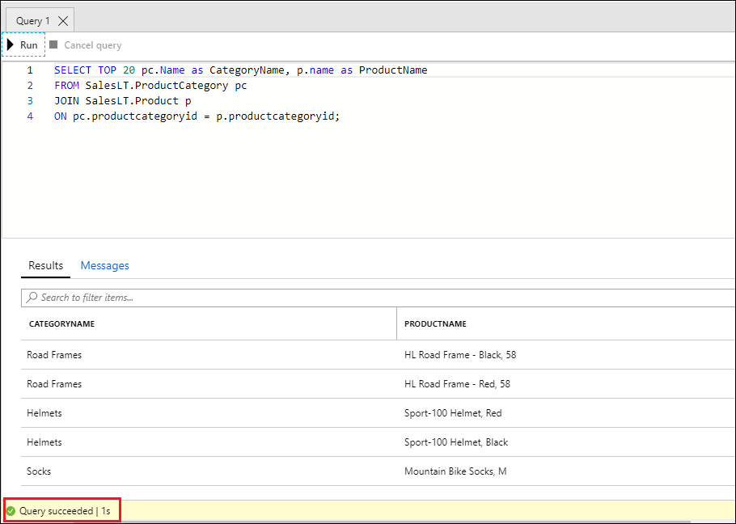

# Lab 06 - Create a SQL database

## Lab overview

A SQL database is a collection of tables that stores a specific set of structured data using a relational model. It is designed to efficiently organize and retrieve data using a language called Structured Query Language (SQL).

In this walkthrough, we will create a SQL database in Azure and then query the data in that database.

## Lab objectives

In this lab, you will complete the following tasks:

+ Task 1: Create the database
+ Task 2: Test the database

## Estimated timing: 20 minutes

## Architecture diagram

 

### Task 1: Create the database

In this task, we will create a SQL database based on the AdventureWorksLT sample database. 

1. On the Azure portal, from the **Search resources, services, and docs** blade, search for and select **SQL databases**, and then click **+ Create**. 

1. On the **Basics** tab, fill in this information.  

    | Setting | Value | 
    | --- | --- |
    | Subscription | **Choose your subscription** |
    | Resource group | **myRGDb-<inject key="DeploymentID" enableCopy="false"/>** |
    | Database name| **db1** | 
    
1. Next to the **Server** drop down list, click **Create new**. Click **OK** when finished.          

    | Setting | Value | 
    | --- | --- |
    | Server name | **sqlserver<inject key="DeploymentID" enableCopy="false"/>** (must be unique) |
    | Location | **(US) East US** |
    | Authentication method | **Use SQL authentication** | 
    | Server admin login | **sqluser** |
    | Password | **Pa$$w0rd1234** |
    | Confirm Password | **Pa$$w0rd1234** |
   
   

1. Move to the **Networking** tab and configure the following settings (leave others with their defaults) 

    | Setting | Value | 
    | --- | --- |
    | Connectivity method | **Public endpoint** |    
    | Allow Azure services and resources to access this server | **Yes** |
    | Add current client IP address | **No** |
  
    
   

1. On the **Security** tab. 
 
    | Setting | Value | 
    | --- | --- |
    | Enable Microsoft Defender for SQL| **Not now** |

1. Move to the **Additional settings** tab. We will be using the AdventureWorksLT sample database, if pop-up comes, click on **OK**.

    | Setting | Value | 
    | --- | --- |
    | Use existing data | **Sample** |
   

    

1. Click **Review + create**, review the configurations, and then click **Create** to deploy and provision the resource group, server, and database. Deployment may take approximately 2 to 5 minutes.

1. Wait for the deployment to get succeeded.

### Task 2: Test the database

In this task, we will configure the SQL server and run a SQL query. 

1. From the **Search resources, services, and docs** blade, search and select **SQL databases** and ensure your new database was created. You may need to **Refresh** the page.

    

1. Click the **db1** entry representing the SQL database you created, and then click **Query editor (preview)** from the left navigation pane.

1. Login as **sqluser** with the password **Pa$$w0rd1234**.

1.  If you are not able to login. 

    
    
    **Note:** If you are able to login proceed with step 9.

1. From the **db1** blade, click **Overview**. 

    

1. From the SQL server **Overview** blade, click **Set server firewall**.

1. Scroll down to the Firewall rules section and click on **+ Add your client IPv4 address**. Be sure to **Save** your changes. 

    

1. Return to your SQL database and the **Query Editor (Preview)** login page. Try to login again as **sqluser** with the password **Pa$$w0rd1234**. Click on **OK**. This time you should succeed. Note that it may take a couple of minutes for the new firewall rule to be deployed. 

1. Once you log in successfully the query pane appears, enter the following query into the editor pane.

    ```
    SELECT TOP 20 pc.Name as CategoryName, p.name as ProductName
    FROM SalesLT.ProductCategory pc
    JOIN SalesLT.Product p
    ON pc.productcategoryid = p.productcategoryid;
    ```

    

1. Click **Run**, and then review the query results in the **Results** pane. The query should run successfully.

    

    > **Congratulations** on completing the task! Now, it's time to validate it. Here are the steps:
    > - Click Lab Validation tab located at the upper right corner of the lab guide section and navigate to the Lab Validation tab.
    > - Hit the Validate button for the corresponding task.
    > - If you receive a success message, you can proceed to the next task. If not, carefully read the error message and retry the step, following the instructions in the lab guide.
    > - If you need any assistance, please contact us at labs-support@spektrasystems.com. We are available 24/7 to help you out.

### Review
In this lab, you have completed:
- Create the database
- Test the database

## Reference link

- https://learn.microsoft.com/en-us/sql/relational-databases/databases/create-a-database?view=sql-server-ver16
  
## You have successfully completed this lab.
