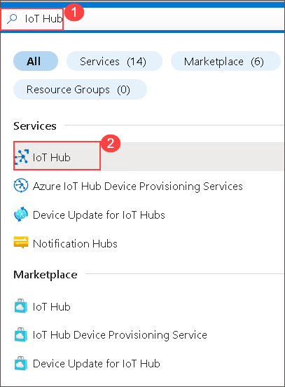
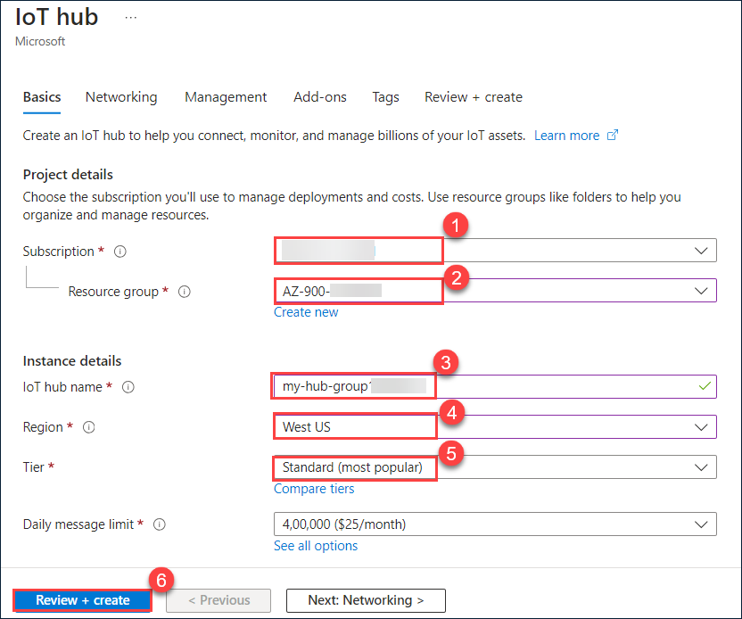
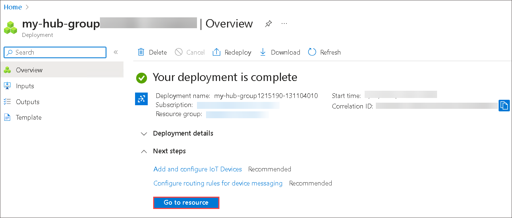
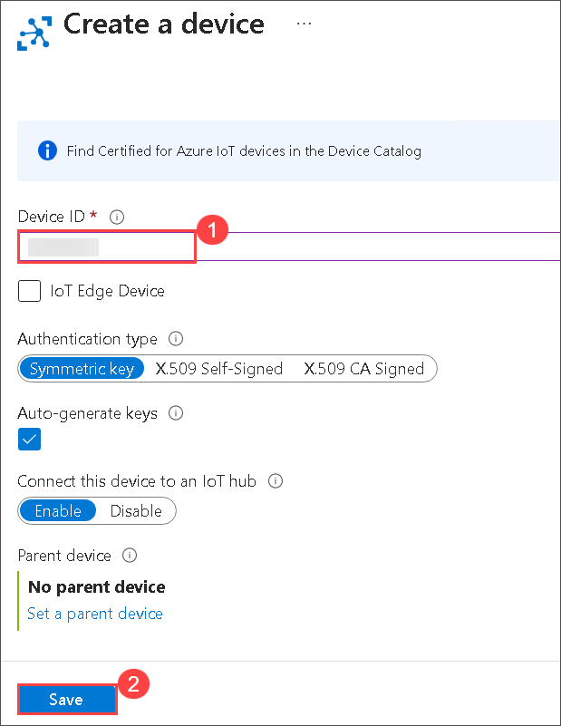
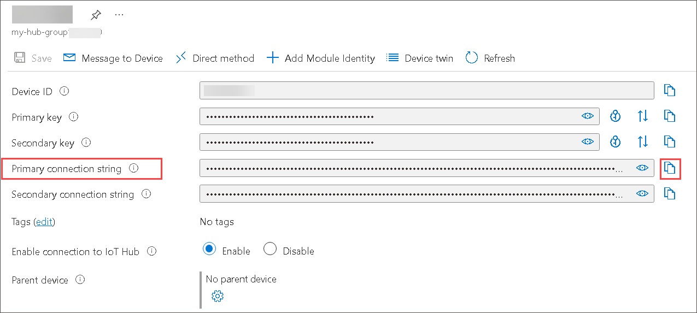
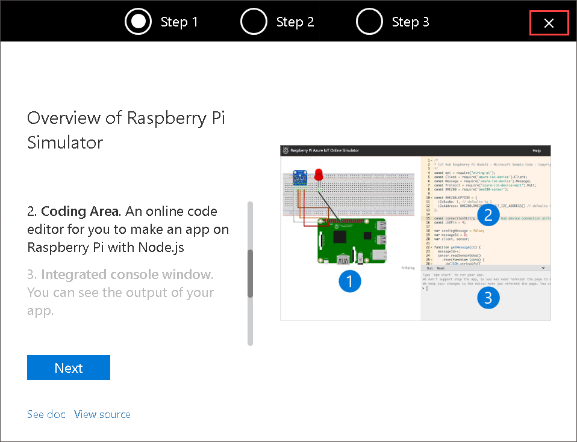
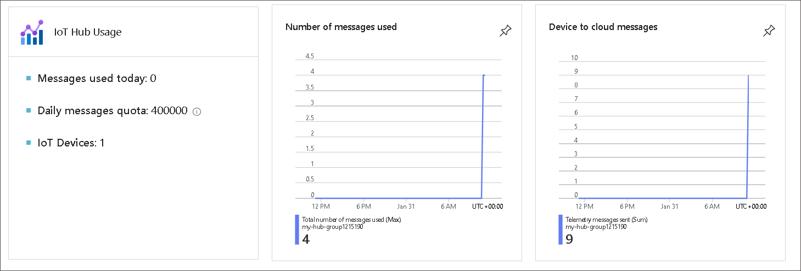

# Lab 07 - Implement an Azure IoT Hub

## Lab overview

The Internet of Things (IoT) is a network of physical devices that connect to and exchange data with other devices and services over the Internet or other network. Azure IoT Hub is a managed service hosted in the cloud that acts as a central message hub for communication between an IoT application and its attached devices.

Azure IoT Edge is a device-focused runtime that enables you to deploy, run, and monitor containerized Linux workloads.

Azure IoT Edge is made up of three components:

 - IoT Edge modules are containers that run Azure services, third-party services, or your own code. Modules are deployed to IoT Edge devices and execute locally on those devices.
 
 - The IoT Edge runtime runs on each IoT Edge device and manages the modules deployed to each device.

 - A cloud-based interface enables you to remotely monitor and manage IoT Edge devices.

In this walkthrough, we will configure a new Azure IoT Hub in Azure Portal, and then authenticate a connection to an IoT device using the online Raspberry Pi device simulator. Sensor data and messages are passed from the Raspberry Pi simulator to your Azure IoT Hub, and you view metrics for the messaging activity in Azure Portal.

## Lab objectives

In this lab, you will complete the following tasks:

+ Task 1: Create an IoT hub
+ Task 2: Add an IoT device
+ Task 3: Test the device using the Raspberry Pi Simulator

## Estimated timing: 20 minutes

## Architecture diagram

 

### Task 1: Create an IoT hub

In this task, we will create an IoT hub. 

1. On Azure Portal page, in **Search resources, services and docs (G+/)** box at the top of the portal, enter **IoT Hub (1)**, and then select **IoT Hub (2)** under services.

   
  
1. On the **Iot Hub** blade, click **+ Create**.

1. On the **Basics** tab of the **IoT hub** blade, fill in the fields with the following details and click **Review + create (6)**.

    | Settings | Value |
    |--|--|
    | Subscription | **Accept default subscription (1)** |
    | Resource Group | **myRGIoT-<inject key="DeploymentID" enableCopy="false" /> (2)**  |
    | IoT Hub Name | **my-hub-group<inject key="DeploymentID" enableCopy="false" /> (3)** |
    | Region | **<inject key="Region" enableCopy="false"/> (4)** |
    | Tier | **Standard (most popular) (5)** |
    |||

    
  
1. Click the **Create** button on **Review + create** tab to begin creating your new Azure IoT Hub instance.

1. Wait until the Azure IoT Hub instance is deployed. 

### Task 2: Add an IoT device

In this task, we will add an IoT device to the IoT hub. 

1. When the deployment has completed, click **Go to resource** from the deployment blade. Alternatively, from the **All services** blade, search for and select **IoT Hub** and locate your new IoT Hub instance

	

1. To add a new IoT device, scroll down to the **Device management** section and click **Devices (1)**. Then, click **+ Add Device (2)**.

	

   >**Note:** If you are not able to see the left navigation pane, please try out zoom out/in in the browser settings inside the lab vm.

1. Provide a **Device ID** for your new IoT device, **<inject key="DeploymentID" enableCopy="false" />** **(1)**, and click the **Save (2)** button. This will create a new IoT device identity in your Azure IoT Hub.

   
  
1. If you do not see your new device, **Refresh** the IoT Devices page.

   

1. Select **<inject key="DeploymentID" enableCopy="false" />** and copy the **Primary Connection String** value. You will use this key in the next task to authenticate a connection to the Raspberry Pi simulator.

	

### Task 3: Test the device using the Raspberry Pi Simulator

In this task, we will test our device using the Raspberry Pi Simulator. 

1. Open a new tab in the web browser and browse to the [online Raspberry Pi simulator](https://azure-samples.github.io/raspberry-pi-web-simulator/#Getstarted). 

1. Read about the Raspberry Pi simulator. If there is an overview pop-up select "**X**" to close the window.

    

1. In the code area, right side, locate the line with 'const connectionString ='. Replace **[Your IoT hub device connection string]**  with the connection string you copied from the Azure portal. Note that the connection sting includes the **DeviceId** and **SharedAccessKey** entries.

	

1. Click **Run** (below the code area) to run the application.

    
  
1. The console output should show the sensor data and messages that are sent from the Raspberry Pi simulator to your Azure IoT Hub. Data and messages are sent each time the Raspberry Pi simulator LED flashes. 

	

1. Click **Stop** to stop sending data.

1. Return to the Azure portal and your IoT Hub.

1. Switch the IoT Hub **Overview** blade and scroll down to the **IoT Hub Usage** information notice the chart and you can select change **Show data for last** to see the data based on days.

   

<validation step="26929d92-e1ca-4d56-9087-22d15854f414" />

> **Congratulations** on completing the task! Now, it's time to validate it.

### Review
In this lab, you have completed:
- Created an IoT hub
- Added an IoT device
- Tested the device using the Raspberry Pi Simulator

## Reference links

- https://learn.microsoft.com/en-us/azure/iot-hub/iot-concepts-and-iot-hub
  
- https://learn.microsoft.com/en-us/azure/iot-edge/about-iot-edge?view=iotedge-1.4

  
## You have successfully completed this lab.
