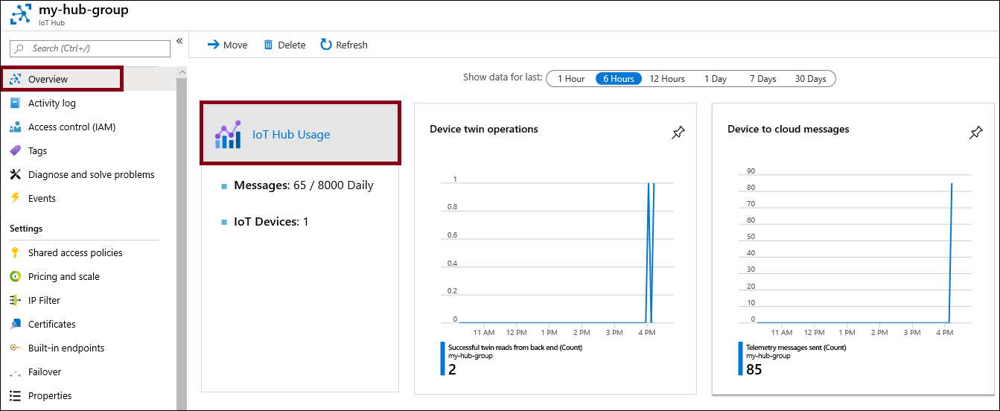

# Lab 07 - Implement an Azure IoT Hub

In this walkthrough, we will configure a new Azure IoT Hub in Azure Portal, and then authenticate a connection to an IoT device using the online Raspberry Pi device simulator. Sensor data and messages are passed from the Raspberry Pi simulator to your Azure IoT Hub, and you view metrics for the messaging activity in Azure Portal.

## Objectives

In this lab, you will complete the following tasks:

+ Task 1: Create an IoT hub
+ Task 2: Add an IoT device
+ Task 3: Test the device using the Raspberry Pi Simulator

## Estimated timing: 10 minutes

## Architecture diagram

 

# Task 1: Create an IoT hub

In this task, we will create an IoT hub. 

1. Click on the Azure Portal icon on the VM desktop and login with the Azure credentials from the Lab Environment output page.

2. From the **All services** blade, search for and select **IoT Hub** and then click **+ Create**.

3. On the **Basics** tab of the **IoT hub** blade, fill in the fields with the following details:

    | Settings | Value |
    |--|--|
    | Subscription | **Choose your subscription** |
    | Resource Group | **myRGIoT-<inject key="DeploymentID" enableCopy="false" />** (use existing) |
    | Region | **East US** |
    | IoT Hub Name | **my-hub-group<inject key="DeploymentID" enableCopy="false" />** |
    | Tier | **Standard (most popular)”** |
    | | |

    
4. Click the **Review + create** button.

5. Click the **Create** button to begin creating your new Azure IoT Hub instance.

6. Wait until the Azure IoT Hub instance is deployed. 

# Task 2: Add an IoT device

In this task, we will add an IoT device to the IoT hub. 

1. When the deployment has completed, click **Go to resource** from the deployment blade. Alternatively, from the **All services** blade, search for and select **IoT Hub** and locate your new IoT Hub instance

	

2. To add a new IoT device, scroll down to the **Device management** section and click **Devices**. Then, click **+ Add Device**.

	

3. Provide a **Device ID** for your new IoT device, **<inject key="DeploymentID" enableCopy="false" />**, and click the **Save** button. This will create a new IoT device identity in your Azure IoT Hub.

4. If you do not see your new device, **Refresh** the IoT Devices page. 

5. Select **myRaspberryPi** and copy the **Primary Connection String** value. You will use this key in the next task to authenticate a connection to the Raspberry Pi simulator.

	

# Task 3: Test the device using the Raspberry Pi Simulator

In this task, we will test our device using the Raspberry Pi Simulator. 

1. Open a new tab in the web browser and browse to the [online Raspberry Pi simulator](https://azure-samples.github.io/raspberry-pi-web-simulator/#Getstarted). 

2. Read about the Raspberry Pi simulator. If there is an overview pop-up select "**X**" to close the window.

3. In the code area, right side, locate the line with 'const connectionString ='. Replace it with the connection string you copied from the Azure portal. Note that the connection sting includes the DeviceId (**myRaspberryPi**) and SharedAccessKey entries.

	

4. Click **Run** (below the code area) to run the application. The console output should show the sensor data and messages that are sent from the Raspberry Pi simulator to your Azure IoT Hub. Data and messages are sent each time the Raspberry Pi simulator LED flashes. 

	

5. Click **Stop** to stop sending data.

6. Return to the Azure portal and your IoT Hub.

7. Switch the IoT Hub **Overview** blade and scroll down to the **IoT Hub Usage** information.

   

   Congratulations! You have set up Azure IoT Hub to collect sensor data from an IoT device.

   > **Congratulations** on completing the task! Now, it's time to validate it. Here are the steps:
   > - Click Lab Validation tab located at the upper right corner of the lab guide section and navigate to the Lab Validation tab.
   > - Hit the Validate button for the corresponding task.
   > - If you receive a success message, you can proceed to the next task. If not, carefully read the error message and retry the step, following the instructions in the lab guide.
   > - If you need any assistance, please contact us at labs-support@spektrasystems.com. We are available 24/7 to help you out.

   Select the **Resources** tab, then in actions select deallocate to deallocate the VM, it will be Cost effective

### Review
In this lab, you have completed:
- Create an IoT hub
- Add an IoT device
- Test the device using the Raspberry Pi Simulator
  
## You have successfully completed this lab.
