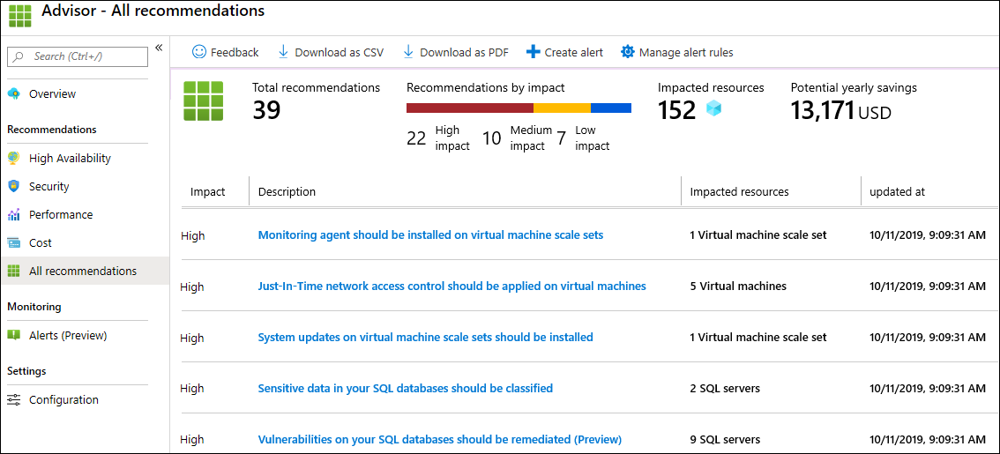

# Lab 10 - Create a VM with PowerShell

## Lab overview

In this walkthrough, we will configure the Cloud Shell, use Azure PowerShell module to create a resource group and virtual machine, and review Azure Advisor recommendations.

## Lab objectives

In this lab, you will complete the following tasks:

+ Task 1: Configure the Cloud Shell
+ Task 2: Create a virtual machine
+ Task 3: Execute commands in the Cloud Shell
+ Task 4: Review Azure Advisor Recommendations

## Estimated timing: 15 minutes

## Architecture diagram


### Task 1: Configure the Cloud Shell

In this task, we will configure Cloud Shell.

1. From the Azure portal, open the **Azure Cloud Shell** by clicking on the icon in the top right of the Azure Portal.

    

1. If you have previously used the Cloud Shell, proceed to the next task.

1. When prompted to select either **Bash** or **PowerShell**, select **PowerShell**.

1. When prompted, select **Show advanced settings** and then select **Use existing** and choose resource group myRGPS-<inject key="DeploymentID" enableCopy="false"/>. Then select **Create new** against Storage account as well as File Share and provide a unique value in both of the fields and then click on **Create storage**, and wait for the Azure Cloud Shell to initialize.

### Task 2: Create a virtual machine

In this task, we will use PowerShell to create a resource group and a virtual machine.

1. Ensure **PowerShell** is selected in the upper-left drop-down menu of the Cloud Shell pane.

1. In the PowerShell session, within the Cloud Shell pane, get existing resource group.

    ```
    Get-AZResourceGroup
    ```

1. Verify your resource group.

    ```
    Get-AzResourceGroup | Format-Table
    ```

1. Create a virtual machine. When prompted provide the username (**azureuser**) and the password (**Pa$$w0rd1234**) that will be configured as the local Administrator account on that virtual machines. Ensure that you include the tick (`) characters at the end of each line except for the last one (there should not be any tick characters if you type entire command on a single line).

   **Note**: Replace myRGPS-<inject key="DeploymentID" enableCopy="false"/> in the below command with the Resource Group Name from the output 
   of the previous command

    ```
     New-AzVm `
    -ResourceGroupName "myRGPS-[DeploymentId]" `
    -Name "myVMPS" `
    -Location "eastus" `
    -Size "Standard_DS1_v2" `
    -Image "MicrosoftWindowsServer:WindowsServer:2022-datacenter-azure-edition:latest" `
    -VirtualNetworkName "myVnetPS" `
    -SubnetName "mySubnetPS" `
    -SecurityGroupName "myNSGPS" `
    -PublicIpAddressName "myPublicIpPS"
    ```
    **Note**: Wait for VM to deploy before closing PowerShell

1. Close the PowerShell session Cloud Shell pane.

1. In the Azure portal, search for **Virtual machines** and verify the **myVMPS** is running. This may take a few minutes.

    

1. Access the new virtual machine and review the Overview and Networking settings to verify your information was correctly deployed.

   > **Congratulations** on completing the task! Now, it's time to validate it. Here are the steps:
   > - Click Lab Validation tab located at the upper right corner of the lab guide section and navigate to the Lab Validation tab.
   > - Hit the Validate button for the corresponding task.
   > - If you receive a success message, you can proceed to the next task. If not, carefully read the error message and retry the step, following the instructions in the lab guide.
   > - If you need any assistance, please contact us at labs-support@spektrasystems.com. We are available 24/7 to help you out.

    **Note**: You can try validating the task after 3-5 minutes, if validations are failing.

### Task 3: Execute commands in the Cloud Shell

In this task, we will practice executing PowerShell commands from the Cloud Shell.

1. From the Azure portal, open the **Azure Cloud Shell** by clicking on the icon in the top right of the Azure Portal.

1. Ensure **PowerShell** is selected in the upper-left drop-down menu of the Cloud Shell pane.

1. Retrieve information about your virtual machine including name, resource group, location, and status. Notice the PowerState is **running**.

    ```
    Get-AzVM -name myVMPS -status | Format-Table -autosize
    ```

1. Stop the virtual machine. When prompted confirm (Yes) to the action.

   **Note**: Replace myRGPS-[deployId] with **myRGPS-<inject key="DeploymentID" enableCopy="false" />**
    ```
    Stop-AzVM -ResourceGroupName myRGPS-[deployId] -Name myVMPS
    ```

1. Verify your virtual machine state. The PowerState should now be **deallocated**. You can also verify the virtual machine status in the portal.

    ```
    Get-AzVM -name myVMPS -status | Format-Table -autosize
    ```

### Task 4: Review Azure Advisor Recommendations

**Note:** This same task is in the Create a VM with Azure CLI lab.

In this task, we will review Azure Advisor recommendations for our virtual machine.

1. From the **All services** blade, search for and select **Advisor**.

1. On the **Advisor** blade, select **Overview**. Notice recommendations are grouped by Reliability, Security, Performance, and Cost.

    

    **Note:** Depending on your resources, your recommendations will be different and you might get the notification "You are following all of our performance recommendations".

1. Select **All recommendations** and take time to view each recommendation and suggested actions.

    **Note:** Depending on your resources, your recommendations will be different and you might get the notification "You are following all of our performance recommendations".

    

1. Notice that you can download the recommendations as a CSV or PDF file.

1. Notice that you can create alerts.

1. If you have time, continue to experiment with Azure PowerShell.

### Review
In this lab, you have completed:
- Configure the Cloud Shell
- Create a virtual machine
- Execute commands in the Cloud Shell
- Review Azure Advisor Recommendations

## You have successfully completed this lab.
