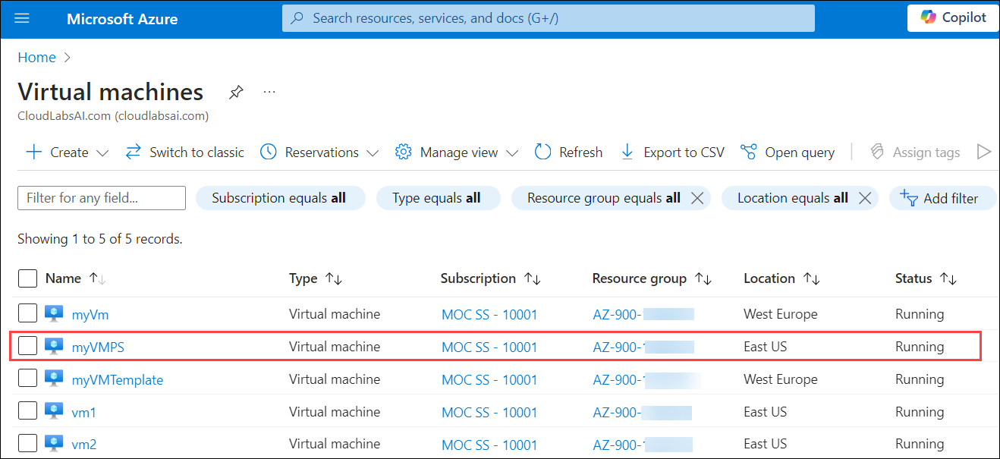
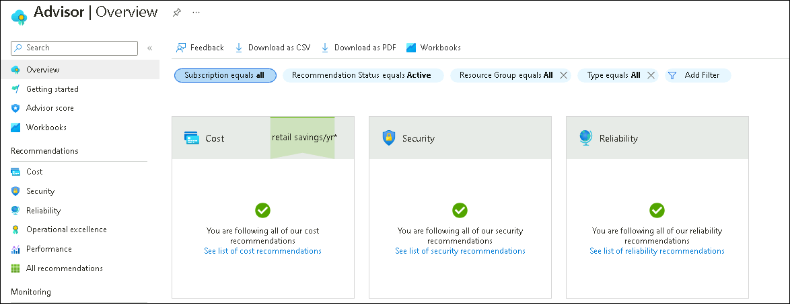

# Lab 10 - Create a VM with PowerShell 

## Lab overview

In this walkthrough, we will configure the Cloud Shell, use Azure PowerShell module to create a resource group and virtual machine, and review Azure Advisor recommendations.

## Lab objectives

In this lab, you will complete the following tasks:

+ Task 1: Configure the Cloud Shell
+ Task 2: Create a virtual machine
+ Task 3: Execute commands in the Cloud Shell
+ Task 4: Review Azure Advisor Recommendations

## Estimated timing: 15 minutes

## Architecture diagram


### Task 1: Configure the Cloud Shell

In this task, we will configure Cloud Shell.

1. From the Azure portal, open the **Azure Cloud Shell** by clicking on the icon in the top right of the Azure Portal.

    

1. The first time you open the Cloud Shell, you may be prompted to choose the type of shell you want to use (*Bash* or *PowerShell*). If so, select **Powershell**.

1. On the Getting started, select **Mount storage account** and select your subscription under storage account subscription. Click on **Apply**.

1. On the Mount storage account tab, select **I want to create a storage account**. Click on **Next**.

1. On the create storage account tab, provide the details and select **Create**

    | Settings | Values |
    |  -- | -- |
    | Subscription | **Existing subscription**|
    | Storage account name | **blob<inject key="DeploymentID" enableCopy="false"/>**|
    | Resource group | **myRGVM-<inject key="DeploymentID" enableCopy="false"/>**|
    | Location | **(US) East US**|
    | File share | **none**|

### Task 2: Create a virtual machine

In this task, we will use PowerShell to create a resource group and a virtual machine.

1. Ensure **PowerShell** is selected in the upper-left drop-down menu of the Cloud Shell pane.

1. In the PowerShell session, within the Cloud Shell pane, get existing resource group.

    ```
    Get-AZResourceGroup
    ```

1. Verify your resource group.

    ```
    Get-AzResourceGroup | Format-Table
    ```

1. Create a virtual machine. When prompted provide the username as **azureuser** and the password: **Pa$$w0rd1234**. <br>This will be configured as the local Administrator account on that virtual machines. Ensure that you include the tick (`) characters at the end of each line except for the last one (there should not be any tick characters if you type entire command on a single line).

    ```
     New-AzVm `
    -ResourceGroupName "myRGPS-<inject key="DeploymentID" enableCopy="false"/>" `
    -Name "myVMPS" `
    -Location "eastus" `
    -Size "Standard_B2s" `
    -Image "MicrosoftWindowsServer:WindowsServer:2022-datacenter-azure-edition:latest" `
    -VirtualNetworkName "myVnetPS" `
    -SubnetName "mySubnetPS" `
    -SecurityGroupName "myNSGPS" `
    -PublicIpAddressName "myPublicIpPS"
   ```
1. Wait for VM to deploy before closing PowerShell

1. Close the PowerShell session Cloud Shell pane.

1. In the Azure portal, search for **Virtual machines** and verify the **myVMPS** is running. This may take a few minutes.

    

1. Access the new virtual machine and review the Overview and Networking settings to verify your information was correctly deployed.

<validation step="c360033e-35db-4af4-af84-b54e7711a019" />

> **Congratulations** on completing the task! Now, it's time to validate it.

>**Note**: You can try validating the task after 3-5 minutes, if validations are failing.

### Task 3: Execute commands in the Cloud Shell

In this task, we will practice executing PowerShell commands from the Cloud Shell.

1. From the Azure portal, open the **Azure Cloud Shell** by clicking on the icon in the top right of the Azure Portal.

1. Ensure **PowerShell** is selected in the upper-left drop-down menu of the Cloud Shell pane.

1. Retrieve information about your virtual machine including name, resource group, location, and status. Notice the PowerState is **running**.

    ```
    Get-AzVM -name myVMPS -status | Format-Table -autosize
    ```

1. Stop the virtual machine. When prompted confirm (Yes) to the action.

    ```
    Stop-AzVM -ResourceGroupName myRGPS-<inject key="DeploymentID" enableCopy="false"/> -Name myVMPS
    ```
1. For **This cmdlet will stop the specified virtual machine. Do you want to continue?** enter **Y**.

1. Verify your virtual machine state. The PowerState should now be **deallocated**. You can also verify the virtual machine status in the portal.

    ```
    Get-AzVM -name myVMPS -status | Format-Table -autosize
    ```

### Task 4: Review Azure Advisor Recommendations

>**Note:** This same task is also performed in hands-on-lab for **Create a VM with Azure CLI lab**.

In this task, we will review Azure Advisor recommendations for our virtual machine.

1. From the **Search resources,services and Docs** blade, search for and select **Advisor**.

1. On the **Advisor** blade, select **Overview**. Notice recommendations are grouped by Reliability, Security, Performance, and Cost.

    

    >**Note:** Depending on your resources, your recommendations will be different and you might get the notification "You are following all of our performance recommendations".

1. Select **All recommendations** from the left navigation pane and take time to view each recommendation and suggested actions.

    >**Note:** Depending on your resources, your recommendations will be different and you might get the notification "You are following all of our performance recommendations".

    

1. Notice that from the **Security** option in the left navigation pane,you can download the recommendations as a CSV or PDF file.

    

1. Notice that from the **Alerts** in the left navigation pane, you can create alerts.

### Review
In this lab, you have completed:
- Configured the Cloud Shell
- Created a virtual machine
- Executed commands in the Cloud Shell
- Reviewed Azure Advisor Recommendations

## Reference link

- https://learn.microsoft.com/en-us/azure/virtual-machines/windows/quick-create-powershell

## You have successfully completed this lab.
