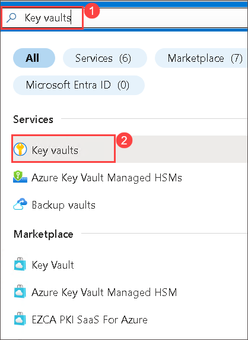
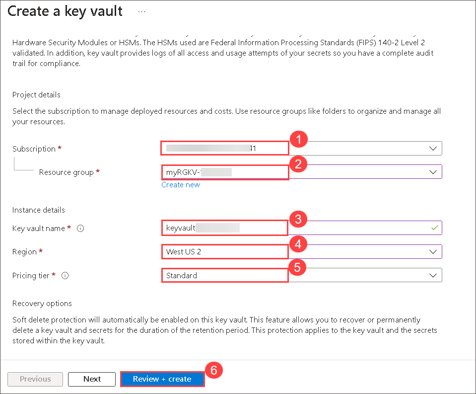
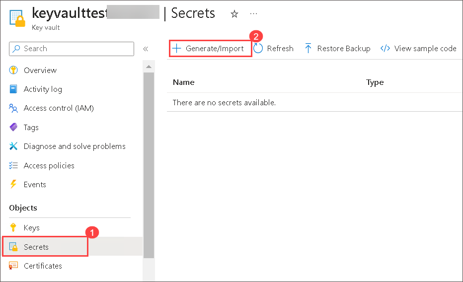
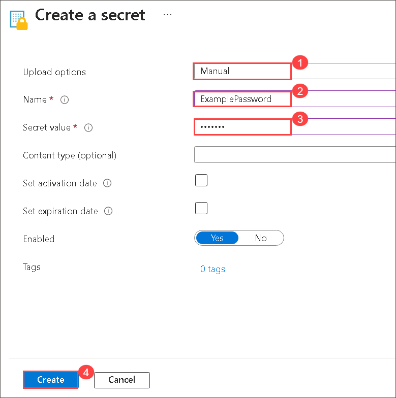
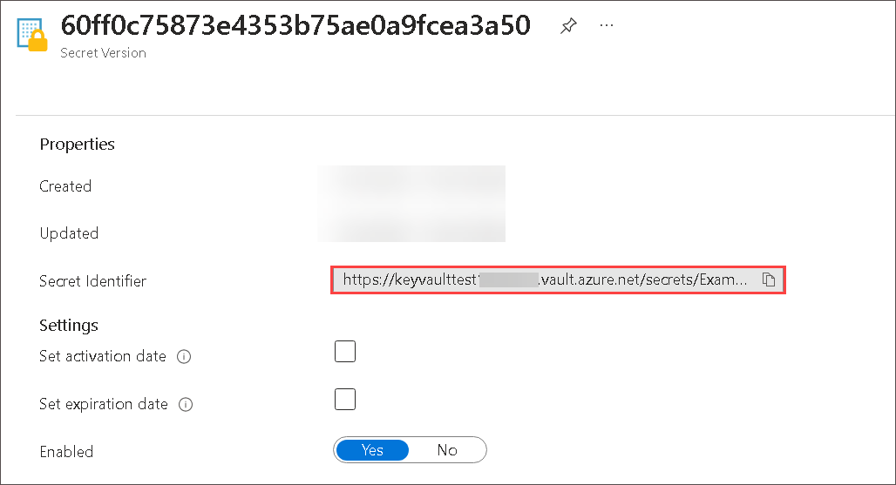

# Lab 12 - Implement Azure Key Vault

## Lab overview

Azure Key Vault is a cloud service for securely storing and accessing secrets. A secret is anything that you want to tightly control access to, such as API keys, passwords, certificates, or cryptographic keys. 

In this walkthrough, we will create an Azure Key vault and then create a password secret within that key vault, providing a securely stored, centrally managed password for use with applications.

## Lab objectives

In this lab, you will complete the following tasks:

+ Task 1: Create an Azure Key Vault
+ Task 2: Add a secret to the Key Vault

## Estimated timing: 10 minutes

## Architecture diagram

### Task 1: Create an Azure Key Vault

1. On Azure Portal page, in **Search resources, services and docs (G+/)** box at the top of the portal, enter **Key vaults (1)**, and then select **Key vaults (2)** under services.

   
  
1. On **Key vaults** blade, select **+ Create**.

1. On the **Basics tab** specify the following to configure the key vault and click on **Review + create (6)**.

    | Setting | Value | 
    | --- | --- |
    | Subscription | **Accept default subscription (1)** |
    | Resource group | **myRGKV-<inject key="DeploymentID" enableCopy="false" /> (2)**  |
    | Key vault name | **keyvaulttest<inject key="DeploymentID" enableCopy="false" /> (3)** |
    | Location | **<inject key="Region" enableCopy="false"/> (4)** |
    | Pricing tier | **Standard (5)** |
    | | |

    
   
1. Click **Create**. 

1. Once the new key vault is provisioned, click **Go to resource**.

   

1. Click on the key vault **Overview** tab and take note of the **Vault URI**. Applications that use your vault through the REST API will need this URI.

1. Take a moment to browse through some of the other key vault options. Under **Objects** review **Keys**, **Secrets**, **Certificates**.

    
   
   **Note**: Your Azure account is the only one authorized to perform operations on this new vault.
   
### Task 2: Add a secret to the Key Vault
        
In this task, we will add a password to the key vault. 

1. Under **Objects** click **Secrets (1)**, then click **+ Generate/Import (2)**.

   
   
1. Configure the secret. Leave the other values at their defaults. Notice you can set an activation and expiration date. Notice you can also disable the secret and click **Create (4)**.

    | Setting | Value | 
    | --- | --- |
    | Upload options | **Manual (1)** |
    | Name | **ExamplePassword (2)** |
    | Value | **hVFkk96 (3)** |
    | | |

    
   
1. Wait until you see the secret has been successfully created, refresh the page once if your not able to see the secret.

1. Once **ExamplePassword** secret is listed notice it has a status of **Enabled**.

    

1. Select the **ExamplePassword** secret and click the current version.

   

1. Under **properties**, note the **Secret Identifier**. This is the URL value that you can now use with applications. It provides a centrally managed and securely stored password. 

   
   
1. Click the button **Show Secret Value**, under **Settings** to display the password you specified earlier.

   
   
   > **Congratulations** on completing the task! Now, it's time to validate it. Here are the steps:
   > - Click Lab Validation tab located at the upper right corner of the lab guide section and navigate to the Lab Validation tab.
   > - Hit the Validate button for the corresponding task.
   > - If you receive a success message, you can proceed to the next task. If not, carefully read the error message and retry the step, following the instructions in the lab guide.
   > - If you need any assistance, please contact us at labs-support@spektrasystems.com. We are available 24/7 to help you out.

### Review
In this lab, you have completed:
- Create an Azure Key Vault
- Add a secret to the Key Vault

## Reference link

- https://learn.microsoft.com/en-us/azure/key-vault/general/basic-concepts
  
## You have successfully completed this lab.
