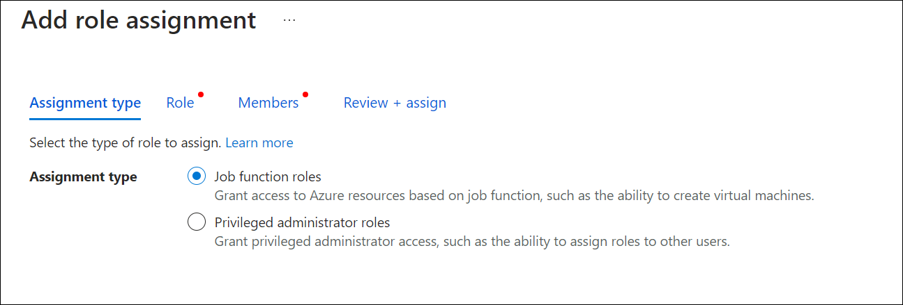

# Lab 14 - Manage access with RBAC

### Lab overview

In this walkthrough, we will assign roles and view activity logs.

## Lab objectives

In this lab, you will complete the following tasks:

+ Task 1: View and assign roles
+ Task 2: Monitor role assignments and remove a role

## Estimated timing: 15 minutes

## Architecture diagram

### Task 1: View and assign roles

In this task, we will assign the Virtual machine contributor role. 

1. From the **Search resources, services, and docs** blade, search for and select **Resource groups**

1. Then view the existing resource group. 

    | Setting | Value |
    | -- | -- |
    | Resource group | **myRGRBAC-<inject key="DeploymentID" enableCopy="false"/>** |

     
1. Click on the existing resource group

1. You will be directed to the overview page of the resource group

1. Click on the **Access control (IAM)** blade, and then switch to the **Roles** tab. Scroll through the large number of roles definitions that are available. Use the Informational icons to get an idea of each role's permissions. Notice there is also information on the number of users and groups that are assigned to each role.

   

1. Switch to the **Role assignments** tab of the **myRGRBAC-<inject key="DeploymentID" enableCopy="false"/> Access control (IAM)** blade, click **+ Add** and then click **Add role assignment**. In  Assignment type keep things as default, then switch to Roles tab, Search for the Virtual Machine Contributor role and select. Switch to the "Members" tab and Assign access to: the user, group, or service principal. Then click + Select members and type your azure account name (Username: <inject key="AzureAdUserEmail"></inject>) to the popup search function and hit 'select.' Then hit 'Review + Assign'.

    

     **Note:** The Virtual machine contributor role lets you manage virtual machines, but not access their operating system or manage the virtual network and storage account they are connected to. User name can be obtained from the Lab Environment output page

1. **Refresh** the Role assignments page and ensure you are now listed as a Virtual machine contributor. 

    **Note**: This assignment does not grant you any additional privileges, since your account has already the Owner role, which includes all privileges associated with the Contributor role.

### Task 2: Monitor role assignments and remove a role

In this task, we will view the activity log to verify the role assignment, and then remove the role. 

1. On the myRGRBAC-<inject key="DeploymentID" enableCopy="false"/> resource group blade, click **Activity log**.

1. Click **Add filter**, select **Operation**, and then **Create role assignment**.

    

1. Verify the Activity log shows your role assignment. (With your User Id). 

    **Note**: Can you figure out how to remove your role assignment?

   > **Congratulations** on completing the task! Now, it's time to validate it. Here are the steps:
   > - Click Lab Validation tab located at the upper right corner of the lab guide section and navigate to the Lab Validation tab.
   > - Hit the Validate button for the corresponding task.
   > - If you receive a success message, you can proceed to the next task. If not, carefully read the error message and retry the step, following the instructions in the lab guide.
   > - If you need any assistance, please contact us at labs-support@spektrasystems.com. We are available 24/7 to help you out.
 
### Review
In this lab, you have completed:
- View and assign roles
- Monitor role assignments and remove a role
  
## You have successfully completed this lab.
