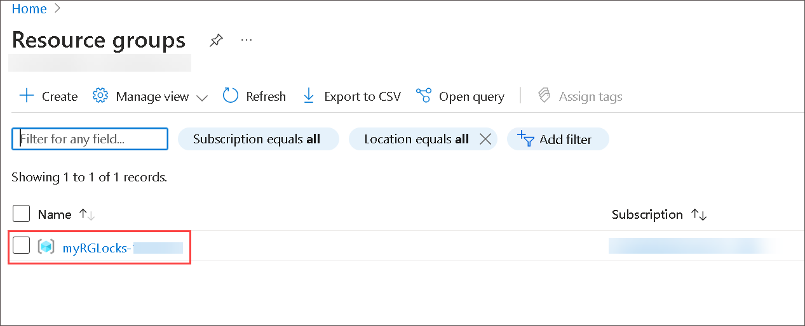
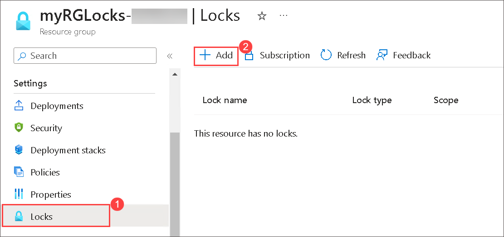
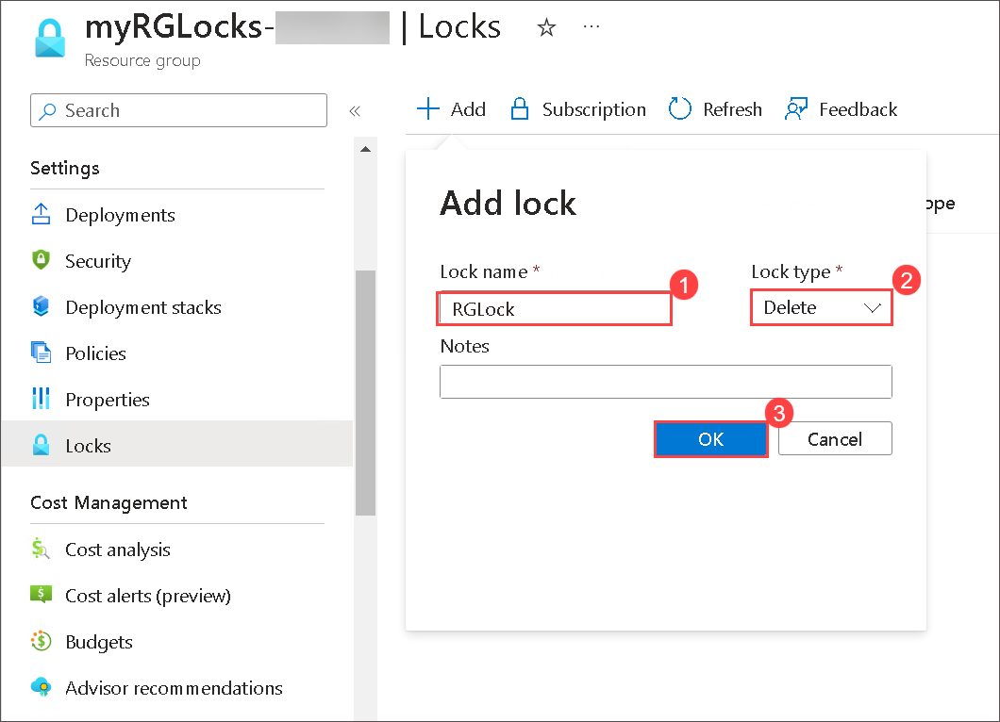
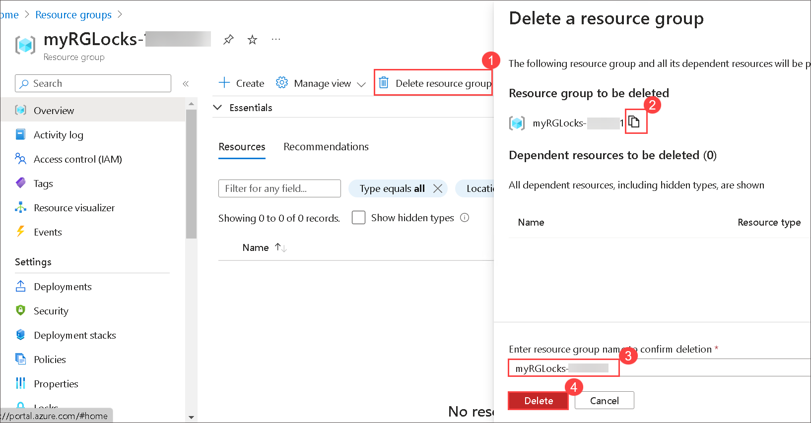
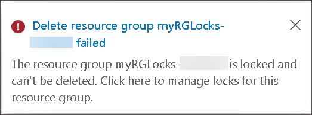
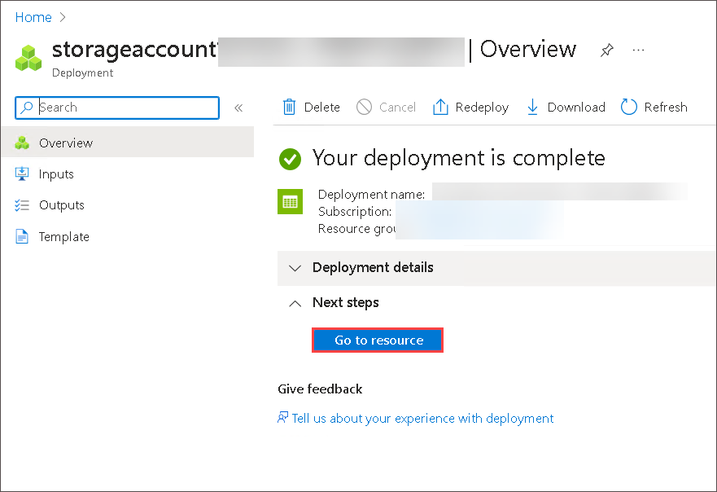
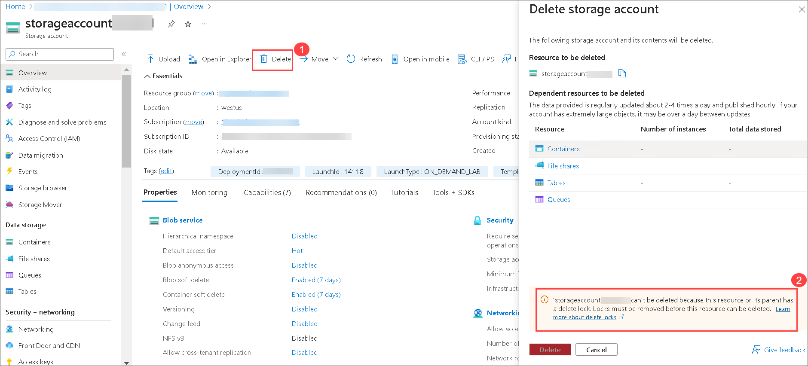
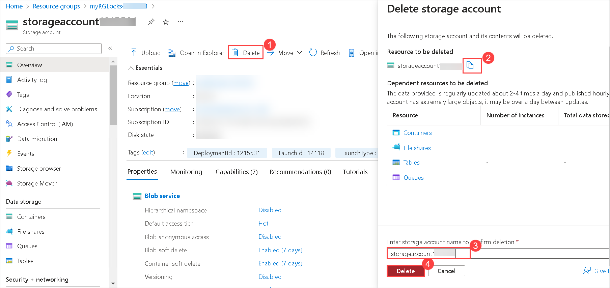

# Lab 15 - Manage resource locks

## Lab overview

To protect your Azure resources from accidental deletions or modifications, you can use management locks. These locks allow you to enforce restrictions at different levels: subscription, resource group, or individual resource.

In this walkthrough,  we will verify the existing resource group, add a lock to the resource group and test deletion, test deleting a resource in the resource group, and remove the resource lock.

## Lab objectives

In this lab, you will complete the following tasks:

+ Task 1: Verify the existing resource group
+ Task 2: Add a Lock to the resource group and test deletion
+ Task 3: Test deleting a member of the resource group
+ Task 4: Remove the resource lock

## Estimated timing: 15 minutes

## Architecture diagram

### Task 1: Verify the existing resource group

In this task, we will verify the existing resource group for this exercise. 

1. On Azure Portal page, in Search resources, services and docs (G+/) box at the top of the portal, enter **Resource groups (1)**, and then select **Resource groups (2)** under services.

   

1. View the existing resource group.

   

### Task 2:  Add a Lock to the resource group and test deletion

In this task, we will add a resource lock to the resource group and test deleting the resource group. 

1. In the Azure portal, navigate to the existing resource group **myRGLocks-<inject key="DeploymentID" enableCopy="false" />**.

1. You can apply a lock to a subscription, resource group, or individual resource to prevent accidental deletion or modification of critical resources. 

1. In the **Settings** section, click **Locks (1)**, and then click **+ Add (2)**. 

    

1. Configure the new lock. When you are done click **OK (3)**. 

    | Setting | Value | 
    | --- | --- |
    | Lock name | **RGLock (1)** |
    | Lock Type | **Delete (2)** |
    |||

    

1. On **myRGLocks-<inject key="DeploymentID" enableCopy="false" /> | Locks** blade, from the left navigation select **Overview**.

1. On **myRGLocks-<inject key="DeploymentID" enableCopy="false" />** blade, click on **Delete resource group (1)**. Copy the **Resource Group** name **(2)** and paste it into the **Enter resource group name to confirm deletion (3)** and click **Delete** **(4)** then confirm the deletion by selecting **Delete** on **Delete Confirmtion** window.

   

1. You receive an error message stating the resource group is locked and can't be deleted.

    

### Task 3: Test deleting a member of the resource group

In this task, we will test if the resource lock protects a storage account in the resource group. 

1. On Azure Portal page, in Search resources, services and docs (G+/) box at the top of the portal, enter **Storage accounts (1)**, and then select **Storage accounts (2)** under services.

    
  
1. On the **Storage accounts** blade, click **+ Create**. 

1. On the **Basics** tab of the **Create storage account** blade, fill in the following information. Leave the defaults for everything else and click on **Review (7)**.

    | Setting | Value |
    | --- | --- |
    | Subscription | **accept the default (1)** |
    | Resource group | **myRGLocks-<inject key="DeploymentID" enableCopy="false" /> (2)** |
    | Storage account name | **storageaccount<inject key="DeploymentID" enableCopy="false" /> (3)** |
    | Region | **<inject key="Region" enableCopy="false"/> (4)**   |
    | Performance | **Standard (5)** |
    | Replication | **Locally redundant storage (LRS) (6)** |
    |||

     .png)

1. Once validated, click **Create**. Wait for the notification that the account was successfully created. 

1.  Wait for the notification that the storage account was successfully created and click on **Go to resource**.

     

1. From the **Overview** pane of newly created storage account, click **Delete (1)** and notice **error message** **(2)** stating the resource or its parent has a delete lock. 

    

    **Note**: Although we did not create a lock specifically for the storage account, we did create a lock at the resource group level, which contains the storage account. As such, this *parent* level lock prevents us from deleting the resource and the storage account inherits the lock from the parent.

### Task 4: Remove the resource lock

In this task, we will remove the resource lock and test. 

1. Return to the **myRGLocks-<inject key="DeploymentID" enableCopy="false" />** resource group blade and, in the **Settings** section, click **Locks (1)**. Click the **Delete (2)** link to the right of the **RGLock** entry.

    

1. From the **myRGLocks-<inject key="DeploymentID" enableCopy="false" />** | locks blade, from the left navigation pane left **Overview** and select **storageaccount<inject key="DeploymentID" enableCopy="false" />** storage account.
  
1. On the Storage accounts blade, select **Delect (1)** copy the stoarge account **(2)** name and paste in **Enter storage account name to confirm deletion (3)** field, then click **Delete (4)** and select **Delete** on **Delete Confirmation** windown.

    
  
1. Monitor the notification and confirm you can now delete the resource.

     

   Congratulations! You created a resource group, added a lock to the resource group and tested deletion, tested deleting a resource in the resource group and removed the resource lock. 

   **Note** : **Wait for 10 minutes before heading to the Validation Step**
 
   > **Congratulations** on completing the task! Now, it's time to validate it. Here are the steps:
   > - Click Lab Validation tab located at the upper right corner of the lab guide section and navigate to the Lab Validation tab.
   > - Hit the Validate button for the corresponding task.
   > - If you receive a success message, you can proceed to the next task. If not, carefully read the error message and retry the step, following the instructions in the lab guide.
   > - If you need any assistance, please contact us at labs-support@spektrasystems.com. We are available 24/7 to help you out.

### Review
In this lab, you have completed:
- Verify the existing resource group
- Add a Lock to the resource group and test deletion
- Test deleting a member of the resource group
- Remove the resource lock

## Reference link

- https://learn.microsoft.com/en-us/azure/storage/common/lock-account-resource?tabs=portal
  
## You have successfully completed this lab.
