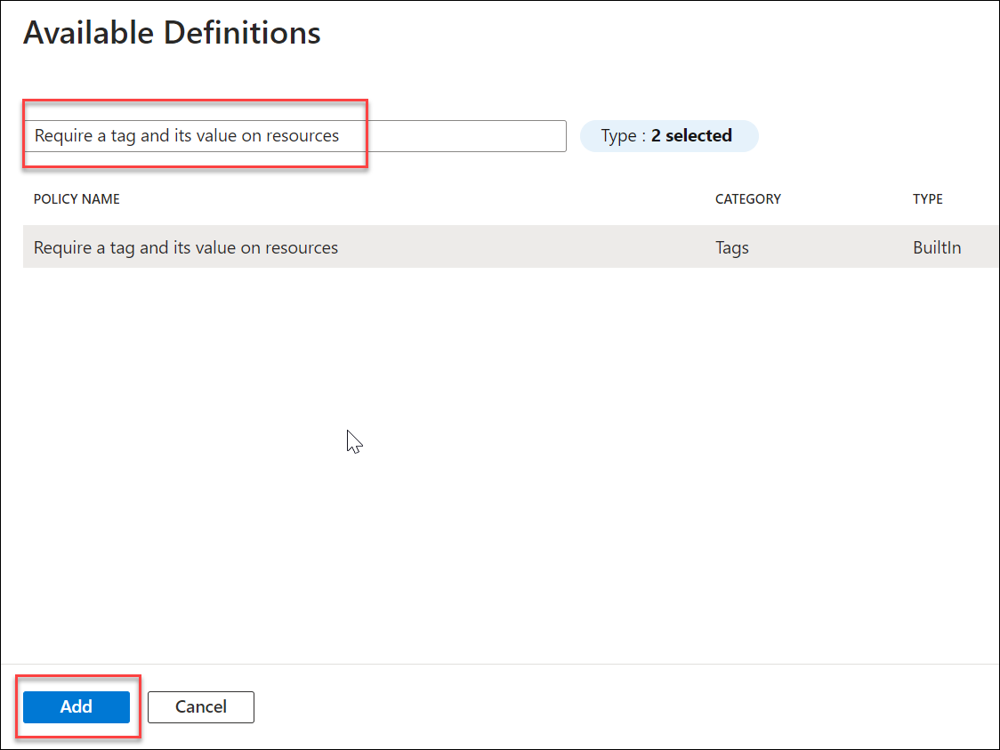
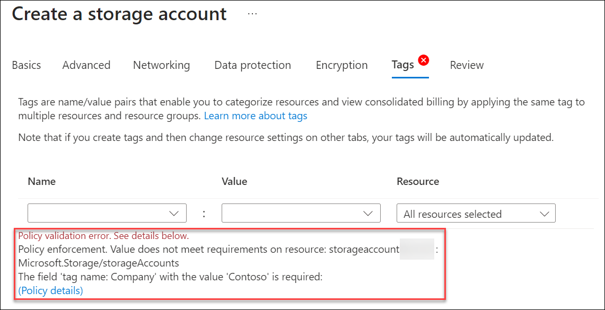

# Lab 16 - Implement resource tagging

## Lab overview

In this walkthrough, we will create a policy assignment that requires tagging, created a storage account and test the tagging, view resources with a specified tag, and remove the tagging policy.

## Lab objectives

In this lab, you will complete the following tasks:

+ Task 1: Create a Policy assignment
+ Task 2: Create a storage account to test the required tagging
+ Task 3: View all resources with a specific tag
+ Task 4: Delete the policy assignment

## Estimated timing: 30 minutes

## Architecture diagram

### Task 1: Create a Policy assignment

In this task, we will configure the **Require a tag on resources** policy and assign it to our subscription. 

1. Click on the Azure Portal icon on the VM desktop.

1. From the **Search resources, services, and docs** blade, search for and select **Policy**.

1. In **Authoring** section, click **Assignments**, and then click **Assign Policy** from the top of the page.

1. Notice the **Scope** for our policy will be subscription wide. 

1. Select the **Policy definition** ellipsis button (end of the textbox on the right). In **Available defination**, Search/Select **Require a tag and its value on resources** definition, then click **Add**.

   

1. On the **Assign policy** blade, Switch to **Parameters** tab, type in **Company** for the Tag name and **Contoso** for the Tag Value. Click **Review + create**, and then **Create**.

    

    **Note:** This is a simple example to demonstrate tagging. Please note that the assignment takes around 30 minutes to take effect. 
 

1. The **Require a tag and its value on resources** policy assignment is now in place. When a resource is created, it must include a tag with the Company : Contoso key.

### Task 2: Create a storage account to test the required tagging

In this task, we will create storage accounts to test the required tagging. 

1. In the Azure Portal, from the **Search resources, services, and docs** blade, search for and select **Storage accounts**, and then click **+ Create**.

1. On the **Basics** tab of the **Create storage account** blade, fill in the following information. Leave the defaults for everything else.

    | Setting | Value | 
    | --- | --- |
    | Subscription | **Use your subscription** |
    | Resource group | **myRGTags** (select existing) |
    | Storage account name | **storageaccount<inject key="DeploymentID" enableCopy="false"/>** |
    | Location | **(US) East US** |
    | | |

1. Click **Review**. 

    **Note:** We are testing to see what happens when the tag is not supplied. 

1. You will receive a Validation failed message. On the **Tags** tab note the error message stating that the resource was disallowed by Policy. 

    

1. Provide the tagging information:- 

    | Setting | Value | 
    | --- | --- |
    | Name | **Company** (may not be in the drop-down list) |
    | Value| **Contoso** (may not be in the drop-down list) |
    | | |

1. Click **Review** and verify that the validation was successful. Click **Create** to deploy the storage account. 

### Task 3: View all resources with a specific tag

1. In the Azure Portal, from the **Search resources, services, and docs** blade, search for and select **Tags**.

1. Note all tags and their values. Click the **Company : Contoso** key/value pair. This will display a blade showing the newly created storage account, as long as you included the tag during its deployment. 

   

1. Click **Add filter** and add the **Company** tag key as the filter category. With the filter applied, only your storage account will be listed.

    
       
   > **Congratulations** on completing the task! Now, it's time to validate it. Here are the steps:
   > - Click Lab Validation tab located at the upper right corner of the lab guide section and navigate to the Lab Validation tab.
   > - Hit the Validate button for the corresponding task.
   > - If you receive a success message, you can proceed to the next task. If not, carefully read the error message and retry the step, following the instructions in the lab guide.
   > - If you need any assistance, please contact us at labs-support@spektrasystems.com. We are available 24/7 to help you out.

### Task 4: Delete the policy assignment

In this task, we will remove the **Require a tag and its value on resources** policy so it does not affect our future work. 

1. In the portal, from the **Search resources, services, and docs** blade, search for and select **Policy**.

1. Click the **Require a tag and its value on resources** policy entry.

1. Click **Delete Assignment** in the top menu.

1. Confirm you wish to delete the policy assignment in the **Delete assignment** dialogue by clicking **Yes**

1. If you have time, create another resource without a tag to ensure the policy is no longer in effect.

   In this walkthrough, we created a policy assignment that required tagging, created a storage account and tested the tagging, viewed resources with a specified tag, and removed the tagging policy.

### Review
In this lab, you have completed:
- Create a Policy assignment
- Create a storage account to test the required tagging
- View all resources with a specific tag
- Delete the policy assignment
  
## You have successfully completed this lab.
