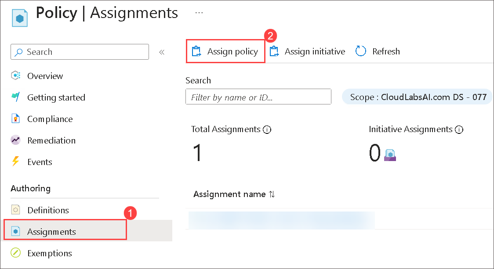
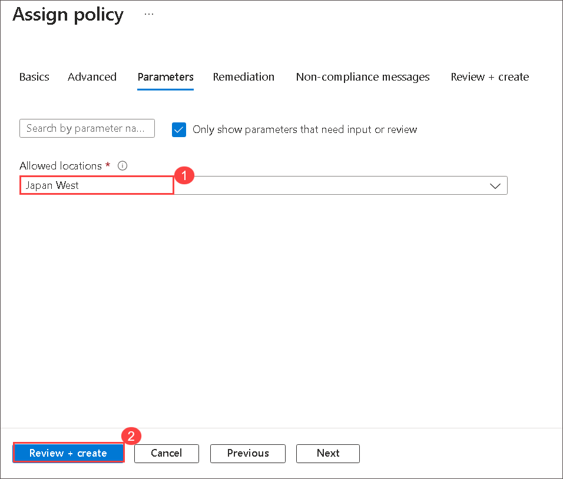
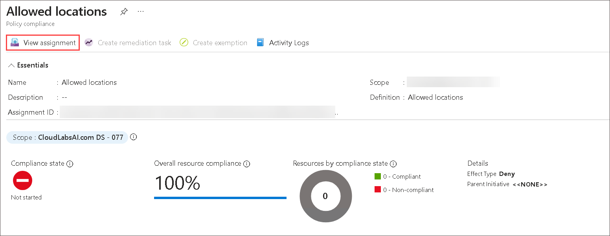

# Lab 17 - Create an Azure Policy

## Lab overview

Azure Policy is a service in Microsoft Azure that allows you to create, assign, and manage policies to enforce compliance with your organization's standards and governance requirements across Azure resources. It helps you ensure that your Azure environment stays compliant with regulations, follows internal policies, and meets security and operational standards.

In this walkthrough, we will create an Azure Policy to restrict the deployment of Azure resources to a specific location.

## Lab objectives

In this lab, you will complete the following tasks:

+ Task 1: Create a Policy assignment
+ Task 2: Test Allowed location policy
+ Task 3: Delete the policy assignment

## Estimated timing: 20 minutes

## Architecture diagram

### Task 1: Create a Policy assignment

In this task, we will configure the allowed location policy and assign it to our subscription. 

1. On Azure Portal page, in Search resources, services and docs (G+/) box at the top of the portal, enter **Policy (1)**, and then select **Policy(2)** under services.

   
  
1. Under the **Authoring** section click **Definitions**.  Take a moment to review the list of built-in policy definitions.

    

1.  For example, in the **Category (1)** drop-down, uncheck **All** checkbox and select only **Compute (2)** then click **Apply (3)**. Notice the **Allowed virtual machine size SKUs** definition enables you to specify a set of virtual machine SKUs that your organization can deploy.

    

1. On the **Policy** page, under the **Authoring** section click **Assignments (1)** > **Assign Policy (2)**. An assignment is a policy that has been assigned to take place within a specific scope. For example, a definition could be assigned to the subscription scope.

    

1. On the **Assign Policy** page, select the **Scope** by clicking the **ellipsis (1)**. Ensure your **subscription (2)** is selected. Notice you can **optionally choose the resource group (3)**. Leave the defaults and click **Select (4)**. 

    

    **Note**: A scope determines what resources or grouping of resources the policy assignment applies to. In our case we could assign this policy to a specific resource group, however, we chose to assign the policy at the subscription level. Be aware that resources can be excluded based on the scope configuration. Exclusions are optional.

1. Select the **Policy definition** ellipsis **(1)** button. In the **Search** box type **Allowed locations (2)** and click on the **Allowed locations (3)** definition, then click **Add**.

    .png)
  
    **Note**: This **Allowed Locations** policy definition will specify a location into which all resources must be deployed. If a different location is chosen, deployment will not be allowed. For more information view the [Azure Policy Samples](https://docs.microsoft.com/en-us/azure/governance/policy/samples/index) page.

1.  In the **Assign policy** pane, switch to the **Parameters** tab, click on the arrow at the end of the **Allowed locations** box, and from the subsequent list choose **Japan West (1)**. Leave all other values as they are and click **Review + create (2)**.

      
    
1.  Click on  **Create**.

1. The **Allowed locations** policy assignment is now listed on the **Policy - Assignments** pane and it is now in place, enforcing the policy at the scope level we specified (subscription level).

   

   >**Note**: You need to refresh the age to see the policy.
   
### Task 2: Test Allowed location policy

In this task, we will test the Allowed location policy. 

1. On Azure Portal page, in Search resources, services and docs (G+/) box at the top of the portal, enter **Storage accounts (1)**, and then select **Storage accounts (2)** under services.

   
   
1. Configure the storage account. Leave the defaults for everything else. 

    | Setting | Value | 
    | --- | --- |
    | Subscription | **Accept default subscription** |
    | Resource group | **myRGPolicy**  |
    | Storage account name | **storageaccount<inject key="DeploymentID" enableCopy="false"/>** |
    | Location | **(US) East US** |
    | | |

1. Notice the error which is disallowing to create stoarge account in east us region which block by the policy

     
    
   **Note**: You will receive the error message under the Region setting stating that Policy enforcement and Value does not meet requirements on resource, including the **Allowed locations** policy name.
      
   > **Congratulations** on completing the task! Now, it's time to validate it. Here are the steps:
   > - Click Lab Validation tab located at the upper right corner of the lab guide section and navigate to the Lab Validation tab.
   > - Hit the Validate button for the corresponding task.
   > - If you receive a success message, you can proceed to the next task. If not, carefully read the error message and retry the step, following the instructions in the lab guide.
   > - If you need any assistance, please contact us at labs-support@spektrasystems.com. We are available 24/7 to help you out.

### Task 3: Delete the policy assignment

In this task, we will remove the Allowed location policy assignment and test. 

We will delete the policy assignment to ensure we are not blocked on any future work we wish to do.

1. On Azure Portal page, in Search resources, services and docs (G+/) box at the top of the portal, enter **Policy (1)**, and then select **Policy(2)** under services.

    

1.  Select **Allowed locations** policy.

     
    
     >**Note**: On the **Policy** blade, you can view the compliance state of the various policies you have assigned.

     >**Note**: The Allowed location policy may show non-compliant resources. If so, these are resources created before the policy assignment.

1. On the Allowed location page, select **View assignment** button.

     
    
1. Click **Delete Assignment** in the top menu.

    
  
 
1. If Prompted confirm you wish to delete the policy assignment in the **Delete assignment** dialogue by clicking **Yes**

1. Now try to create a storage account and the policy will not block the creation.

   >**Note**: Please be aware that it may take some time for the deleted policy to start working.
    
    >**Note**: Common scenarios where the **Allowed locations** policy can be useful include: 
    - *Cost Tracking*: You could have different subscriptions for different regional locations. The policy will ensure that all resources are deployed in the intended region to help with cost tracking. 
    - *Data Residency and Security compliance*: You could also have data residency requirements, create subscriptions per customer or specific workloads, and define that all resources must be deployed in a particular data center to ensure data and security compliance requirements.

### Review
In this lab, you have completed:
- Create a Policy assignment
- Test Allowed location policy
- Delete the policy assignment
  
## You have successfully completed this lab.
