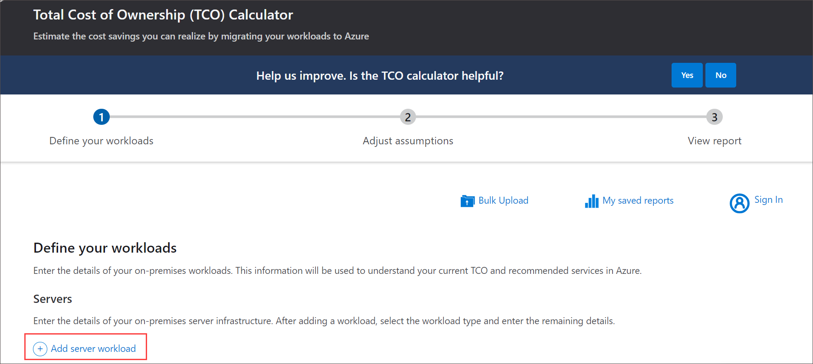
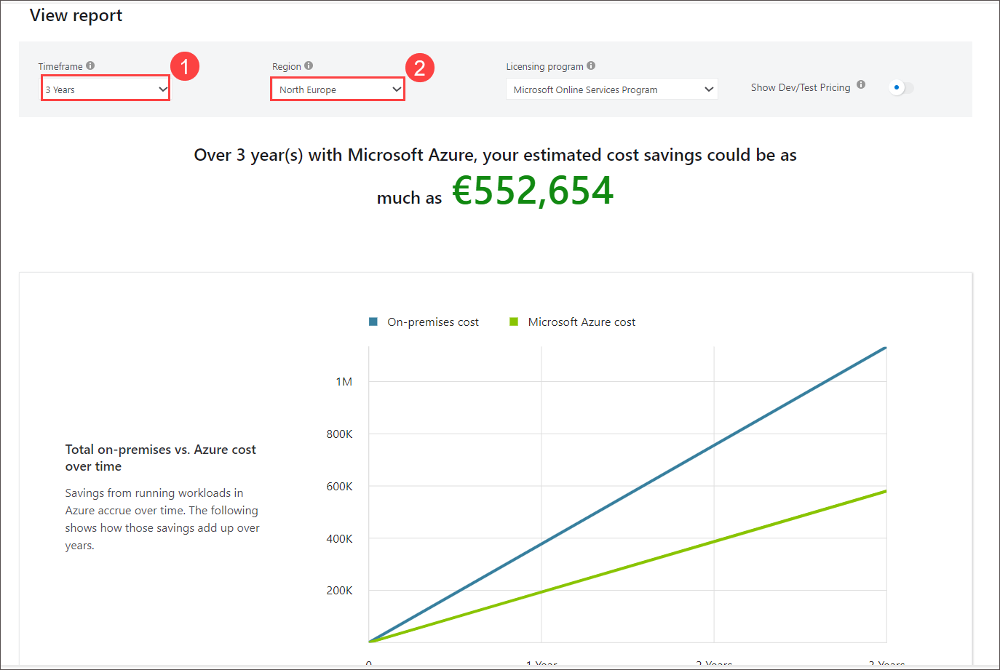

# Lab 20 - Use the Azure TCO Calculator

### Lab overview

In this walkthrough, you will use the Total Cost of Ownership (TCO) Calculator to generate cost comparison report for an on-premises environment.

## Lab objectives

In this lab, you will complete the following tasks:

+ Task 1: Configure the TCO calculator
+ Task 2: Review the results and save a copy

## Estimated timing: 10 minutes

## Architecture diagram

**Note**: This walkthrough provides example definitions of on-premises infrastructure and workloads for a typical datacenter. To create a TCO Calculator report, use the example definitions or provide details of your *actual* on-premises infrastructure and workloads.

### Task 1: Configure the TCO calculator

In this task, we will add infrastructure information to the calculator. 

1. In your own local browser, navigate to the [Total Cost of Ownership (TCO) Calculator](https://azure.microsoft.com/en-us/pricing/tco/calculator/) page.

1. To add details of your on-premises server infrastructure, click **+ Add server workload** in the **Define your workloads** pane.

    | Settings | Value |
    | -- | -- |
    | Name | **Servers: Windows VMs** |
    | Workload | **Windows/Linux server** |
    | Environment | **Virtual Machines** |
    | Operating system | **Windows** |  
    | VMs | **50** |
    | Virtualization | **Hyper-V** |
    | Core(s) | **8**|
    | RAM (GB) | **16** |
    | Optimize by | **CPU** |
    | Windows Server 2008/2008 R2 | **Off** |
    | | |

    
    
   
1. Select **+ Add server workload** to make a row for a new server workloads definition. 

    | Settings | Value |
    | -- | -- |
    | Name | **Servers: Linux VMs** |
    | Workload | **Windows/Linux server** |
    | Environment | **Virtual Machines** |
    | Operating system | **Linux** |  
    | VMs | **50** |
    | Virtualization | **VMware** |
    | Core(s) | **8**|
    | RAM (GB) | **16** |
    | Optimize by | **CPU** |
    | | |

    
   
1. In the **Storage** pane, click **Add storage**.

    | Settings | Value |
    | -- | -- |
    | Name | **Server Storage** |
    | Storage type | **Local Disk/SAN** |
    | Disk type | **HDD** |
    | Capacity | **60 TB** |  
    | Backup | **120 TB** |
    | Archive | **0 TB** |
    | | |

     
      

1. In the **Networking** pane, add bandwidth and click **Next**.

    | Settings | Value |
    | -- | -- |
    | Outbound bandwidth | 15 TB|
    | | |

    

1. Explore the options and make any adjustments that you require. 

    | Settings | Value |
    | -- | -- |
    | Currency | **Euro zone** |
    | | |
    
    

1. Click **Next**.

### Task 2: Review the results and save a copy

In this task, we will review cost saving recommendations and download a report. 

1. Review the Azure cost saving recommendations and visualizations.

    | Settings | Value |
    | -- | -- |
    | Timeframe| **3 years** |
    | Region | **North Europe** |
    | | |

    

1. To save or print a PDF copy of the report, click **Download**.

   

1. To modify the information you provided, go to the bottom of the page, and click **Back**. 

    >**Congratulations!** You have used the TCO Calculator to generate a cost comparison report for an on-premises environment.

### Review
In this lab, you have completed:
- Configure the TCO calculator
- Review the results and save a copy

## You have successfully completed this lab.
