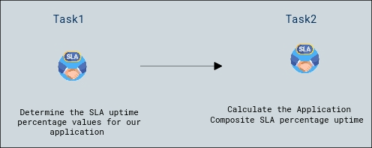
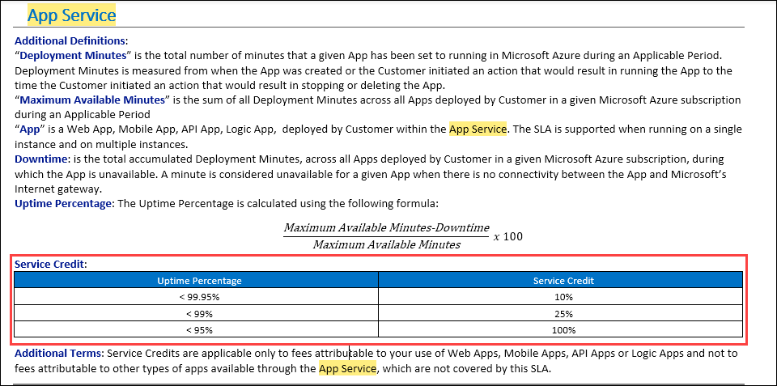

# Lab 21 - Calculate Composite SLAs

## Lab overview

Calculating Composite Service Level Agreements (SLAs) involves determining the overall availability or uptime of a system or service composed of multiple components, each with its own SLA. The composite SLA represents the combined reliability of all the individual components within the system.

In this walkthrough, we will determine availability SLA of Azure services and then calculate application composite SLA-based expected availability.

Our example application consists of these Azure services. We will not go in to deep architectural configuration and considerations, the intention here is to give an high level example.

+ **App service**: To host the application.
+ **Azure AD B2C**: To authenticate user logins and manage profiles.
+ **Application Gateway**: To manage application access, and scaling. 
+ **Azure SQL Database**: To store application data. 

## lab objectives

In this lab, you will complete the following tasks:

+ Task 1: Determine the SLA uptime percentage values for our application
+ Task 2: Calculate the Application Composite SLA percentage uptime
  
## Estimated timing: 5 minutes

## Architecture diagram

### Task 1: Determine the SLA uptime percentage values for our application

1. In your edge browser, go to the [SLA summary for Azure services](https://azure.microsoft.com/en-us/support/legal/sla/summary/) page.

1. Don't make any changes, leave the settings as default, then select the latest version of the SLA.

   

1. It will re-direct you to the word file, download the file, and do press **CTRL + F** in your keyboard.

   

1. Type/Search for **App Service**, and click on App Service search result. Notice the **Monthly uptime percentages** and **Service Credits**.

    

1. Then again Type/Search for **Azure Active Directory B2C** service, now notice the **Monthly uptime percentages** and **Service Credits**.

1. Type/Search for **Application Gateway** and click on the Application Gateway search result now notice the **Monthly uptime percentages** and **Service Credits**.

1. The Azure SQL database uses Premium tiers but is not configured for Zone Redundant Deployments. Locate the **Azure SQL Database** and notice the **Monthly uptime percentages** and **Service Credits**.

    >**Note**: There are different uptime values for different configurations and deployments of Azure SQL Database. It is important you are clear on your required uptime values, when planning and costing your deployment and configuration. Small changes in uptime can have impact on service costs as well as potentially increase complexity in configuration. Some other services that may be of interest on the Azure SLA summary web page would include **Virtual Machines**, **Storage Accounts** and **Cosmos DB**.

### Task 2: Calculate the Application Composite SLA percentage uptime

1. If any of the services that comprises our application are not available our application will not be available for users to sign in to and use. As such the total uptime for our application consists of the following:

    - **App Service % uptime** X **Azure AD B2C % uptime** X  **Azure Application Gateway % uptime** X **Azure SQL Database % uptime** = **Total % Uptime**

    - This is the SLA-based expected availability of our application with the current services and architecture.

### Review
In this lab, you have completed:
- Determine the SLA uptime percentage values for our application
- Calculate the Application Composite SLA percentage uptime

## Reference link

- https://learn.microsoft.com/en-us/azure/well-architected/reliability/metrics

## Congratulation you have successfully completed this lab. Proceed with the next lab. 
